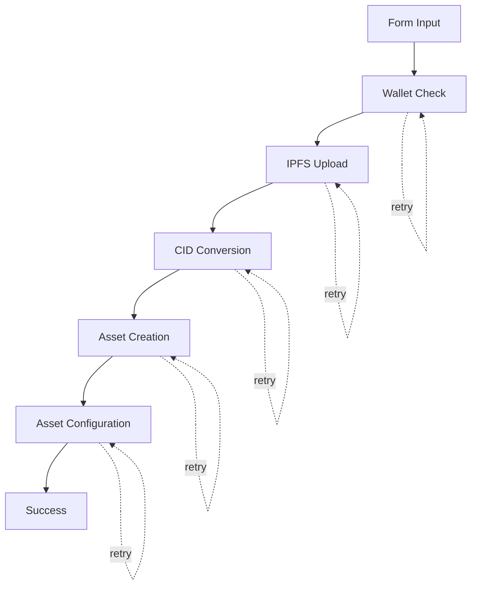

# 🏛️ ArtCertify - Piattaforma di Certificazione Blockchain

**ArtCertify EVM** è il fork della piattaforma di certificazione digitale che usa **Base** (EVM), **Privy** (login email/social/wallet) e **IPFS** (solo da browser). Le certificazioni sono **Soulbound Token (SBT)** ERC-721 + ERC-5192 su Base.


## ArtCertify EVM (Base) – Setup rapido

1. **Env**: copia `env.example` in `.env` e compila:
   - `VITE_PRIVY_APP_ID` (da [Privy Dashboard](https://dashboard.privy.io))
   - `VITE_BASE_RPC_URL`, `VITE_BASE_EXPLORER_URL`
   - `VITE_SBT_CONTRACT_ADDRESS` (dopo il deploy)
   - `VITE_PINATA_API_KEY`, `VITE_PINATA_API_SECRET`, `VITE_PINATA_JWT` (per upload IPFS)

2. **Deploy contratto SBT** (una volta):
   ```bash
   npm install
   npx hardhat compile
   # Imposta DEPLOYER_PRIVATE_KEY in .env, poi:
   npx hardhat run scripts/deploy.ts --network base
   ```
   Imposta in `.env`: `VITE_SBT_CONTRACT_ADDRESS=<indirizzo deployato>`.

3. **Avvio app**:
   ```bash
   npm run dev
   ```

**Differenze rispetto alla versione Algorand**: niente Pera Wallet né JWT backend; auth con Privy; certificati come SBT su Base; storage solo IPFS (Pinata) da browser; profilo organizzazione semplificato/non usato.

---

*La sezione seguente descrive caratteristiche e architettura in modo generale (alcuni riferimenti sono alla versione Algorand).*

## 🚀 Caratteristiche Principali 

### ✨ **Autenticazione Sicura**
- **Pera Wallet Connect** (v1.0): Metodo di autenticazione principale
- **JWT Backend Integration** (v2.0): Autenticazione con backend tramite firma transazione Algorand
- **Terms & Conditions** (v2.0): Accettazione esplicita termini con firma blockchain
- **Session Persistence** (v1.0): Riconnessione automatica tra sessioni
- **Multi-Platform** (v1.0): Supporto mobile (QR Code) e desktop
- **Zero Private Keys** (v1.0): Nessuna chiave privata memorizzata nell'applicazione

### 🏗️ **Certificazione Blockchain**
- **Soulbound Tokens (SBT)**: Certificazioni non trasferibili
- **Standard Compliance**: ARC-3 (Metadata) + ARC-19 (Template URL)
- **Hybrid Storage**: MINIO per file certificazioni + IPFS per metadata JSON
- **IPFS Storage**: Storage decentralizzato con Pinata (solo metadata JSON)
- **MINIO Storage**: Storage centralizzato S3-compatible per file certificazioni
- **Versioning Avanzato**: Cronologia completa delle modifiche
- **Smart Retry System**: Ripresa intelligente dai punti di fallimento

### 🎨 **UI/UX Avanzata**
- **Stepper Interattivo**: Visualizzazione real-time del progresso
- **Link Dinamici**: Collegamenti diretti a IPFS e blockchain explorer
- **Error Handling**: Gestione robusta degli errori con retry specifico per step
- **Design System**: Componenti riutilizzabili con TailwindCSS

### 🔄 **Gestione Asset**
- **Portfolio Visualization**: Visualizzazione completa degli asset
- **Metadata Decoding**: Decodifica automatica CID ARC-19
- **Transaction History**: Storico completo delle transazioni
- **Asset Details**: Visualizzazione dettagliata con allegati IPFS

## 🏗️ Architettura Tecnica

### **Stack Tecnologico Core**

```typescript
Frontend Framework:
├── React 19.1.0 + TypeScript 5.8.3  # Framework moderno
├── Vite 6.3.5                       # Build tool veloce  
├── React Router 7.6.2               # Routing SPA
└── TailwindCSS 3.4.17              # Utility-first CSS

Blockchain Integration:
├── AlgoKit Utils 9.1.0              # Algorand utilities
├── Algorand SDK 3.3.1               # Core blockchain
└── Pera Wallet Connect 1.4.2        # Wallet integration

Storage & IPFS:
├── MINIO/S3 Storage                 # File storage per certificazioni
├── Multiformats 13.3.7              # CID manipulation
├── Uint8arrays 5.1.0                # Binary data handling
└── Pinata API                       # IPFS pinning service (solo metadata JSON)

UI & UX Libraries:
├── Headless UI 2.2.4                # Accessible components
├── Heroicons 2.2.0 + Lucide 0.518.0 # Icon libraries
└── CLSX + Tailwind Merge            # Class utilities
```

### **Struttura del Progetto**

```
artcertify/
├── src/
│   ├── components/                   # 🎨 Componenti React
│   │   ├── ui/                      # Sistema di design base
│   │   │   ├── Button.tsx           # Componente button con varianti
│   │   │   ├── Card.tsx             # Card container riutilizzabile
│   │   │   ├── Modal.tsx            # Modal dialog con overlay
│   │   │   ├── Stepper.tsx          # Stepper interattivo per flussi
│   │   │   ├── DataGrid.tsx         # Griglia dati con sorting/filtering
│   │   │   ├── FileUpload.tsx       # Upload drag & drop
│   │   │   ├── LoadingSpinner.tsx   # Indicatori di caricamento
│   │   │   └── [27 altri componenti UI]
│   │   │
│   │   ├── forms/                   # 📝 Form specializzati
│   │   │   ├── ArtifactForm.tsx     # Form certificazione artefatti
│   │   │   ├── DocumentForm.tsx     # Form certificazione documenti
│   │   │   └── BaseCertificationForm.tsx # Form base condiviso
│   │   │
│   │   ├── modals/                  # 🪟 Dialog e modal (v2.0)
│   │   │   ├── CertificationModal.tsx      # v1.0 - Modal processo certificazione
│   │   │   ├── WalletSignatureModal.tsx   # v2.0 - Modal firma Terms & Conditions
│   │   │   ├── TermsAndConditions.tsx     # v2.0 - Componente Termini e Condizioni
│   │   │   ├── ModifyAttachmentsModal.tsx  # v1.0 - Modal modifica allegati
│   │   │   └── ModifyOrganizationModal.tsx # v1.0 - Modal modifica organizzazione
│   │   │
│   │   ├── asset/                   # 🏛️ Componenti gestione asset
│   │   │   ├── AssetHeader.tsx      # Header dettagli asset
│   │   │   ├── AssetInfoCard.tsx    # Card informazioni asset
│   │   │   ├── AssetDescription.tsx # Descrizione e metadata
│   │   │   ├── AttachmentsSection.tsx # Sezione allegati IPFS
│   │   │   └── TechnicalMetadata.tsx # Metadata tecnici blockchain
│   │   │
│   │   ├── layout/                  # 🏗️ Layout e struttura
│   │   │   └── ResponsiveLayout.tsx # Layout responsive principale
│   │   │
│   │   ├── DashboardPage.tsx        # 🏠 Dashboard principale
│   │   ├── WalletPage.tsx           # 💼 Gestione wallet e portfolio
│   │   ├── AssetDetailsPage.tsx     # 📄 Dettagli asset singolo
│   │   ├── LoginPage.tsx            # 🔑 Autenticazione Pera Wallet
│   │   ├── CertificationsPage.tsx   # 📋 Lista certificazioni
│   │   ├── OrganizationProfilePage.tsx # 🏢 Profilo organizzazione
│   │   ├── RolesPage.tsx            # 👥 Gestione ruoli
│   │   ├── CertificateCard.tsx      # 🎫 Card certificato singolo
│   │   └── VersioningSection.tsx    # 🔄 Sezione versioning asset
│   │
│   ├── hooks/                       # 🪝 Custom Hooks React (v2.0)
│   │   ├── usePeraCertificationFlow.ts # v1.0 - Hook flusso certificazione completo
│   │   ├── usePeraWallet.ts         # v1.0 - Hook integrazione Pera Wallet
│   │   ├── useTransactionSigning.ts # v2.0 - Hook firma transazioni + auth
│   │   ├── useWalletSignature.ts    # v2.0 - Hook gestione firma Terms & Conditions
│   │   ├── useAsyncState.ts         # v1.0 - Hook gestione stati asincroni
│   │   ├── useDebounce.ts           # v1.0 - Hook debounce per ricerche
│   │   ├── useLocalStorage.ts       # v1.0 - Hook persistenza localStorage
│   │   ├── useIPFSMetadata.ts       # v1.0 - Hook gestione metadata IPFS
│   │   ├── useProjectsCache.ts      # v1.0 - Hook cache progetti
│   │   └── useWalletValidation.ts   # v1.0 - Hook validazione wallet
│   │
│   ├── services/                    # 🔧 Servizi Core Business Logic (v2.0)
│   │   ├── peraWalletService.ts     # v1.0 - Servizio Pera Wallet Connect
│   │   ├── authService.ts          # v2.0 - Servizio autenticazione JWT con backend
│   │   ├── algorand.ts              # v1.0 - API Algorand + gestione asset
│   │   ├── ipfsService.ts           # v1.0 - Integrazione Pinata IPFS (solo metadata JSON)
│   │   ├── minioServices.ts         # v2.0 - Integrazione MINIO/S3 per file certificazioni
│   │   ├── ipfsUrlService.ts        # v1.0 - Gestione URL IPFS e gateway
│   │   ├── cidDecoder.ts            # v1.0 - Decodifica CID ARC-19 compliance
│   │   ├── walletService.ts         # v1.0 - Servizi wallet generici
│   │   ├── nftService.ts            # v1.0 - Gestione NFT e portfolio
│   │   └── spidService.ts           # v1.0 - Integrazione SPID (placeholder)
│   │
│   ├── contexts/                    # 🌐 Context React per stato globale
│   │   └── AuthContext.tsx          # Context autenticazione Pera Wallet
│   │
│   ├── types/                       # 📝 Definizioni TypeScript
│   │   ├── asset.ts                 # Tipi asset, NFT e metadata
│   │   └── cid.ts                   # Tipi CID IPFS e decodifica
│   │
│   ├── config/                      # ⚙️ Configurazione applicazione
│   │   └── environment.ts           # Validazione e configurazione env
│   │
│   ├── lib/                         # 🛠️ Utility e helper functions
│   │   └── utils.ts                 # Utility functions condivise
│   │
│   └── assets/                      # 🎨 Asset statici
│       ├── logo.png                 # Logo principale applicazione
│       └── favicon/                 # Set completo favicon multi-device
│
├── docs/                           # 📚 Documentazione completa
│   ├── ARCHITECTURE.md             # Architettura software
│   ├── ALGORAND_INTEGRATION.md     # v1.0 - Integrazione blockchain
│   ├── IPFS_INTEGRATION.md         # v1.0 - Integrazione IPFS e storage
│   ├── PERA_CONNECT_INTEGRATION.md # v1.0 - Integrazione Pera Wallet
│   ├── AUTH_JWT_INTEGRATION.md    # v2.0 - Autenticazione JWT con backend
│   ├── CID_DECODER.md              # v1.0 - Decodifica CID e ARC-19
│   ├── CUSTOM_HOOKS.md             # v2.0 - Documentazione custom hooks
│   ├── DESIGN_SYSTEM.md            # v1.0 - Sistema di design e UI
│   ├── NETWORK_CONFIGURATION.md    # v1.0 - Configurazione rete Algorand
│   ├── ARCHITECTURE.md             # v2.0 - Architettura applicazione
│   ├── DESCRIZIONE_FUNZIONALE.md   # v1.0 - Descrizione funzionale servizi
│   └── README.md                   # v2.0 - Indice documentazione
│
├── public/                         # 🌐 File statici pubblici
│   ├── manifest.json               # PWA manifest
│   ├── favicon.ico                 # Favicon principale
│   └── [icon set completo]         # Icon set multi-dispositivo
│
├── package.json                    # 📦 Dipendenze e script
├── vite.config.ts                  # ⚙️ Configurazione Vite
├── tailwind.config.js              # 🎨 Configurazione TailwindCSS
├── tsconfig.json                   # 🔧 Configurazione TypeScript
├── env.example                     # 📋 Template variabili ambiente
└── README.md                       # 📖 Documentazione principale
```

## 🎯 Flussi Operativi

### **🏗️ Creazione Certificazione**

Il processo di certificazione utilizza un sistema di stepper intelligente con retry automatico:



#### **Step-by-Step Process:**

1. **📋 Form Input**: L'utente compila il form di certificazione
2. **🔐 Wallet Check**: Verifica connessione Pera Wallet
3. **📤 File Upload**: Upload file su MINIO (presigned URL con JWT)
4. **📄 IPFS Upload**: Upload solo metadata JSON su IPFS con Pinata
5. **🔄 CID Conversion**: Conversione CID IPFS in reserve address Algorand
6. **🏗️ Asset Creation**: Creazione SBT con firma Pera Wallet
7. **⚙️ Asset Configuration**: Aggiornamento reserve address con firma Pera Wallet
8. **✅ Success**: Visualizzazione certificazione creata con link esplorativi

### **🔄 Versioning e Modifiche**

Sistema avanzato di versioning per aggiornamenti post-creazione:

1. **🎯 Asset Selection**: Selezione asset esistente dal portfolio
2. **✏️ Modification**: Modifica metadata o sostituzione allegati
3. **📤 Smart Upload**: 
   - **Certificazioni**: Upload nuovi file su MINIO, solo metadata JSON su IPFS
   - **Organizzazioni**: Upload file su IPFS (comportamento legacy)
4. **🔄 Reserve Update**: Aggiornamento reserve address con nuova versione
5. **📊 History Tracking**: Tracciamento automatico cronologia versioni
6. **👁️ Visualization**: Display timeline versioning con link storici

### **💼 Gestione Wallet e Portfolio**

- **🔗 Connection**: Connessione sicura via Pera Wallet Connect
- **👁️ Address Validation**: Validazione automatica indirizzi Algorand
- **💰 Balance Query**: Query real-time saldi e asset posseduti
- **📊 Transaction History**: Recupero storico transazioni complete
- **🎨 Asset Portfolio**: Visualizzazione portfolio NFT con metadati

## 🔧 Setup e Installazione

### **📋 Prerequisiti**

- **Node.js** 18+ (consigliato 20+)
- **npm** 8+ oppure **yarn** 1.22+
- **Pera Wallet** installato (mobile o desktop)
- **Account Algorand** (TestNet o MainNet)
- **Pinata Account** per IPFS gateway

### **⚙️ Configurazione**

1. **📥 Clone del repository**
```bash
git clone <repository-url>
cd artcertify
```

2. **📦 Installazione dipendenze**
```bash
npm install
```

3. **🔐 Configurazione ambiente**
```bash
cp env.example .env.local

# Modifica .env.local con i tuoi valori:
VITE_PINATA_GATEWAY=your-gateway.mypinata.cloud
VITE_PINATA_API_KEY=your_pinata_api_key
VITE_PINATA_API_SECRET=your_pinata_api_secret
VITE_PINATA_JWT=your_pinata_jwt_token

# Configurazione rete (testnet o mainnet)
VITE_ALGORAND_NETWORK=testnet  # o mainnet per produzione

# Backend API (richiesto per autenticazione JWT e upload MINIO)
VITE_API_BASE_URL=http://localhost:8088  # URL del backend API

# MINIO/S3 Storage (gestito tramite backend API con presigned URLs)
# I file vengono caricati su: https://s3.caputmundi.artcertify.com/{userAddress}/{filename}
# Il backend genera presigned URLs tramite endpoint: /api/v1/presigned/upload
```

4. **🚀 Avvio applicazione**
```bash
npm run dev
# Applicazione disponibile su http://localhost:5173
```

### **🌐 Configurazione Rete**

L'applicazione supporta switch automatico tra TestNet e MainNet:

```bash
# TestNet (sviluppo e testing)
VITE_ALGORAND_NETWORK=testnet
# Endpoints automatici:
# - ALGOD: https://testnet-api.algonode.cloud:443
# - INDEXER: https://testnet-idx.algonode.cloud:443
# - Explorer: https://testnet.explorer.perawallet.app

# MainNet (produzione)
VITE_ALGORAND_NETWORK=mainnet  
# Endpoints automatici:
# - ALGOD: https://mainnet-api.algonode.cloud:443
# - INDEXER: https://mainnet-idx.algonode.cloud:443
# - Explorer: https://explorer.perawallet.app
```

## 🛠️ Sviluppo

### **📜 Script Disponibili**

```bash
npm run dev          # Avvio sviluppo con hot reload
npm run build        # Build produzione ottimizzato
npm run preview      # Preview build produzione
npm run lint         # Linting con ESLint
npm run type-check   # Controllo tipi TypeScript
```

### **🎨 Sistema di Design**

Il progetto utilizza un design system completo basato su TailwindCSS:

```typescript
// Esempi componenti base
<Button 
  variant="primary | secondary | outline | ghost"
  size="sm | md | lg | xl"
  isLoading={boolean}
  disabled={boolean}
>
  Testo Button
</Button>

<Card 
  variant="default | outlined | elevated"
  size="sm | md | lg"
  clickable={boolean}
>
  Contenuto Card
</Card>

<Modal 
  isOpen={boolean}
  onClose={() => void}
  size="sm | md | lg | xl | full"
  closeOnBackdrop={boolean}
>
  Contenuto Modal
</Modal>
```

### **🔄 Testing e Debug**

#### **✅ Test Funzionalità Chiave**

1. **Test Connessione Pera Wallet**
```bash
# Avvia app in dev mode
npm run dev  

# Nel browser:
# 1. Vai su http://localhost:5173/login
# 2. Clicca "Connetti con Pera Wallet"
# 3. Scansiona QR code o connetti desktop
# 4. Verifica reindirizzamento a dashboard
```

2. **Test Creazione Certificazione**
```bash
# 1. Assicurati di essere connesso con Pera Wallet
# 2. Vai su Dashboard > "Crea Certificazione"
# 3. Compila form artefatto o documento
# 4. Carica file di test
# 5. Avvia processo certificazione
# 6. Firma transazioni con Pera Wallet
# 7. Verifica asset creato nell'explorer
```

3. **Test Portfolio e Asset Details**
```bash
# 1. Vai su "Wallet" tab
# 2. Verifica visualizzazione portfolio
# 3. Clicca su asset certificato
# 4. Verifica decodifica metadata
# 5. Testa link IPFS e explorer
```

#### **🚨 Troubleshooting Comune**

| Problema | Soluzione |
|----------|-----------|
| **Build Error** | `rm -rf node_modules dist && npm install && npm run build` |
| **Pera Wallet non connette** | Verifica rete (TestNet/MainNet) e versione wallet |
| **IPFS Upload fallisce** | Controlla credenziali Pinata in `.env.local` |
| **Transazione fallisce** | Verifica saldo account e parametri transazione |
| **Explorer link non funziona** | Controlla configurazione rete in environment |

## 🔒 Sicurezza e Compliance

### **🛡️ Sicurezza Blockchain**
- ✅ **Soulbound Tokens**: NFT non trasferibili per certificazioni
- ✅ **Immutable Metadata**: Hash IPFS immutabili su blockchain (solo JSON)
- ✅ **Zero Private Keys**: Nessuna chiave privata nell'applicazione
- ✅ **Pera Wallet Security**: Firma transazioni controllata dall'utente
- ✅ **Network Validation**: Validazione automatica parametri rete

### **🔐 Data Protection**
- ✅ **Hybrid Storage**: MINIO per file + IPFS per metadata JSON
- ✅ **Presigned URLs**: Upload sicuro tramite presigned URLs con JWT
- ✅ **IPFS Decentralization**: Storage distribuito per metadata (solo JSON)
- ✅ **Client-side Processing**: Elaborazione dati lato client
- ✅ **Session Management**: Gestione sicura sessioni wallet
- ✅ **CORS Protection**: Protezione richieste cross-origin

### **📋 Standards Compliance**
- ✅ **ARC-3**: NFT Metadata Standard per descrizioni asset
- ✅ **ARC-19**: Template URL Standard per IPFS integration
- ✅ **IPFS CID v1**: Content Identifier versione 1
- ✅ **JSON Schema**: Validazione rigorosa metadata

## 📚 Documentazione Estesa

La documentazione completa è disponibile nella cartella `/docs/`:

| File | Descrizione |
|------|-------------|
| **[ARCHITECTURE.md](docs/ARCHITECTURE.md)** | Architettura software e pattern utilizzati |
| **[ALGORAND_INTEGRATION.md](docs/ALGORAND_INTEGRATION.md)** | v1.0 - Integrazione blockchain Algorand dettagliata |
| **[IPFS_INTEGRATION.md](docs/IPFS_INTEGRATION.md)** | v1.0 - Integrazione IPFS e servizi Pinata |
| **[PERA_CONNECT_INTEGRATION.md](docs/PERA_CONNECT_INTEGRATION.md)** | v1.0 - Integrazione Pera Wallet Connect |
| **[AUTH_JWT_INTEGRATION.md](docs/AUTH_JWT_INTEGRATION.md)** | v2.0 - Autenticazione JWT con backend API |
| **[CID_DECODER.md](docs/CID_DECODER.md)** | v1.0 - Decodifica CID e compliance ARC-19 |
| **[CUSTOM_HOOKS.md](docs/CUSTOM_HOOKS.md)** | v2.0 - Documentazione custom hooks React |
| **[DESIGN_SYSTEM.md](docs/DESIGN_SYSTEM.md)** | v1.0 - Sistema di design e componenti UI |
| **[NETWORK_CONFIGURATION.md](docs/NETWORK_CONFIGURATION.md)** | v1.0 - Configurazione rete e ambiente |
| **[ARCHITECTURE.md](docs/ARCHITECTURE.md)** | v2.0 - Architettura applicazione e pattern |
| **[DESCRIZIONE_FUNZIONALE.md](docs/DESCRIZIONE_FUNZIONALE.md)** | v1.0 - Descrizione funzionale servizi |

## 🚀 Deployment

### **🏗️ Build di Produzione**

```bash
# Build ottimizzato per produzione
npm run build

# Output generato in /dist/
# File pronti per deployment su servizi statici:
# - Netlify, Vercel, GitHub Pages
# - AWS S3 + CloudFront
# - Azure Static Web Apps
```

### **⚙️ Configurazione Produzione**

```bash
# .env.production
VITE_ALGORAND_NETWORK=mainnet
VITE_PINATA_GATEWAY=your-production-gateway.mypinata.cloud
VITE_PINATA_API_KEY=your_production_api_key
VITE_PINATA_API_SECRET=your_production_secret
VITE_PINATA_JWT=your_production_jwt

# Verifica build
npm run preview
```

### **🔍 Performance Optimization**

- ✅ **Code Splitting**: Lazy loading automatico delle route
- ✅ **Tree Shaking**: Rimozione codice non utilizzato
- ✅ **Bundle Analysis**: Ottimizzazione dimensioni bundle
- ✅ **Asset Optimization**: Compressione immagini e font
- ✅ **Caching Strategy**: Cache intelligente per asset statici

## 🤝 Contribuire

1. **🍴 Fork** del repository
2. **🌿 Crea** un branch feature (`git checkout -b feature/nuova-funzionalita`)
3. **💾 Commit** delle modifiche (`git commit -m 'feat: aggiunge nuova funzionalità'`)
4. **🚀 Push** del branch (`git push origin feature/nuova-funzionalita`)
5. **📝 Apri** una Pull Request con descrizione dettagliata

### **📏 Convenzioni di Sviluppo**

- **🔤 Naming**: camelCase per variabili, PascalCase per componenti
- **📁 Structure**: Feature-based organization per componenti grandi
- **🎨 Styling**: TailwindCSS utility classes, evitare CSS custom
- **🔧 TypeScript**: Tipizzazione forte, evitare `any`
- **📖 Documentation**: Commenti JSDoc per funzioni pubbliche

## 🏢 Informazioni Progetto

### **📄 Licenza**
Sviluppato dall'**ArtCertify Team** con licenza GPLv3.

### **👥 Team**
- **Frontend Development**: React + TypeScript
- **Blockchain Integration**: Algorand + Pera Wallet
- **UI/UX Design**: TailwindCSS + Headless UI
- **DevOps**: Vite + GitHub Actions

### **📞 Supporto**

Per supporto tecnico, domande o contributi:

- **📧 Email**: [info@artcertify.com](mailto:info@artcertify.com)
- **🌐 Website**: [www.artcertify.com](https://www.artcertify.com)
- **📚 Documentazione**: [docs/](docs/)
- **🐛 Issues**: Aprire issue su repository per bug report

---

**🚀 Pronto per iniziare? Segui la [guida di setup](#setup-e-installazione) e inizia a certificare!**
