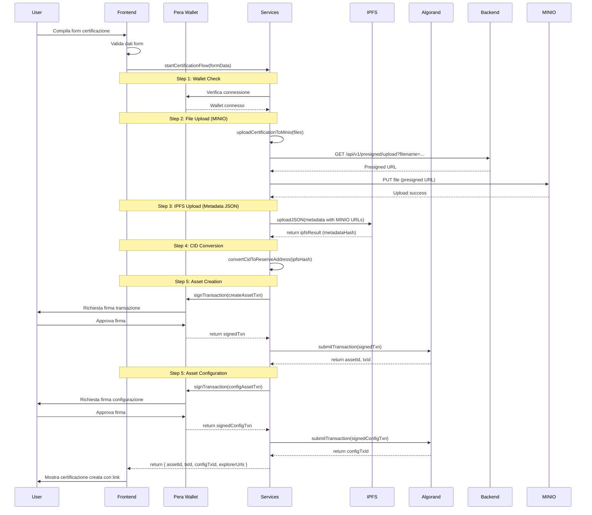
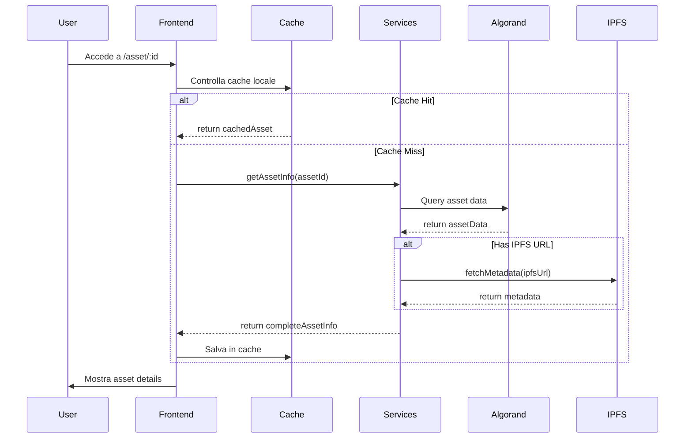
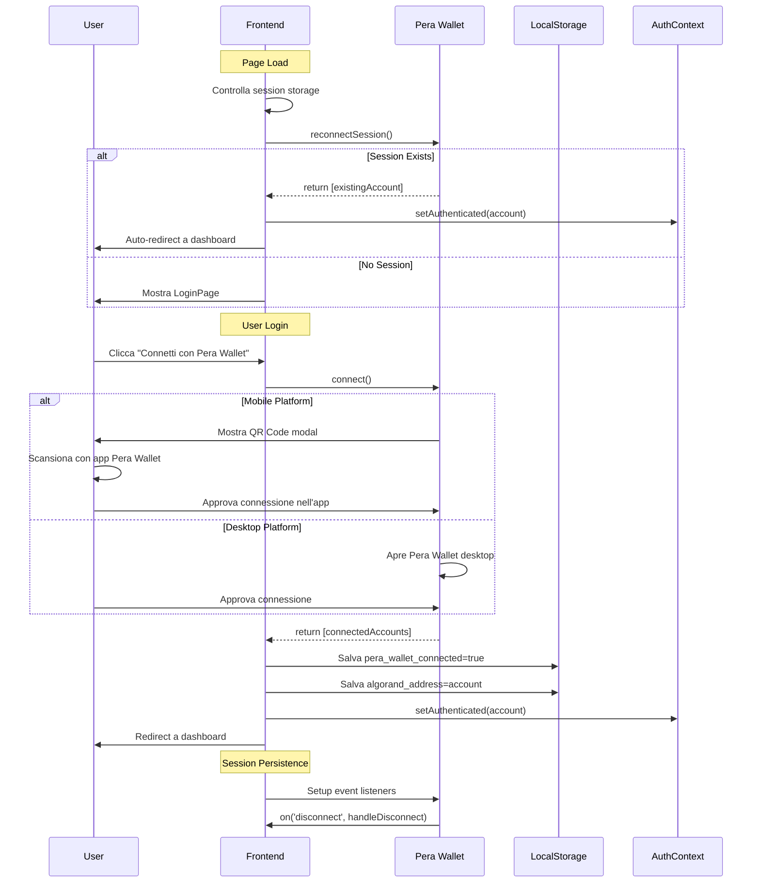
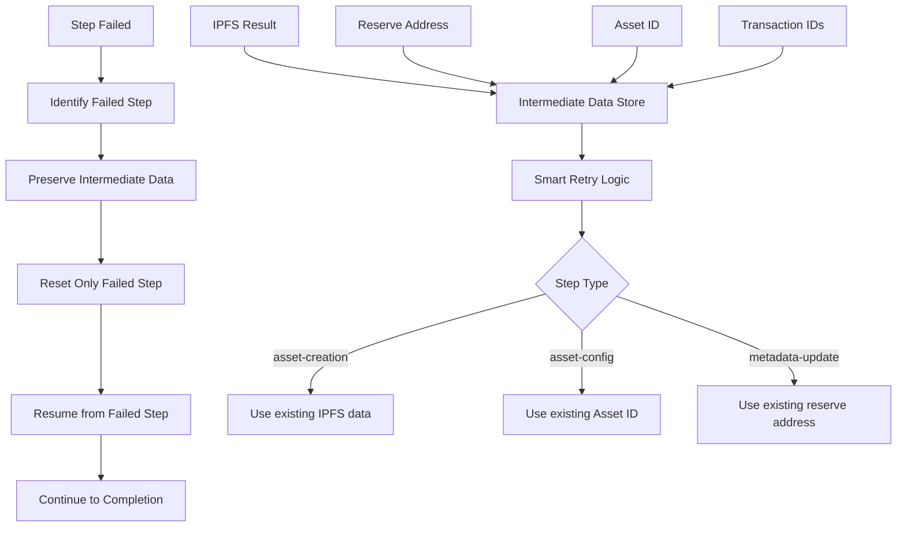

# 🏗️ Architettura ArtCertify

Documentazione completa dell'architettura dell'applicazione ArtCertify, che implementa un sistema avanzato di certificazione digitale blockchain con Pera Wallet Connect e smart retry system.

## 📋 Panoramica

ArtCertify è una Single Page Application (SPA) React moderna che implementa certificazione digitale immutabile tramite Soulbound Tokens (SBT) su blockchain Algorand, con storage decentralizzato IPFS e compliance completa ARC-3 + ARC-19.

### Stack Tecnologico Aggiornato

```
Frontend Moderno:
├── React 19.1.0 + TypeScript 5.8.3  # Framework UI ultima generazione
├── Vite 6.3.5                       # Build tool velocissimo
├── TailwindCSS 3.4.17               # Utility-first CSS
├── React Router 7.6.2               # Routing SPA
├── Headless UI 2.2.4                # Componenti accessibili
└── Heroicons 2.2.0 + Lucide 0.518.0 # Iconografia completa

Blockchain Integration:
├── Algorand SDK 3.3.1               # Core blockchain
├── AlgoKit Utils 9.1.0              # Utilities avanzate
├── Pera Wallet Connect 1.4.2        # Autenticazione sicura
└── Auto Network Configuration       # TestNet/MainNet automatico

Storage Ibrido:
├── MINIO/S3 Storage                 # File certificazioni (centralizzato)
│   ├── Presigned URLs              # Upload sicuro tramite backend API
│   ├── URL Format                  # s3.caputmundi.artcertify.com/{userAddress}/{filename}
│   └── MinIOService (v2.0)         # Gestione upload file
├── IPFS + Pinata Gateway            # Metadata JSON (decentralizzato)
├── Multiformats 13.3.7             # CID manipulation
├── Uint8arrays 5.1.0               # Binary data handling
└── LocalStorage + Session Cache    # Performance client

Services Architettura (v2.0):
├── PeraWalletService (v1.0)        # Pera Wallet Connect integration
├── AuthService (v2.0)              # JWT authentication with backend API
├── AlgorandService (v1.0)          # Blockchain integration
├── IPFSService (v1.0)              # Pinata + ARC-19 integration (solo metadata JSON)
├── MinIOService (v2.0)             # MINIO/S3 file storage per certificazioni
├── IPFSUrlService (v1.0)          # IPFS URL and gateway management
├── CidDecoder (v1.0)               # ARC-19 standard compliance
├── WalletService (v1.0)            # Multi-wallet support
├── NFTService (v1.0)               # Asset portfolio management
└── SPIDService (v1.0)              # SPID identity management (placeholder)
```

## 🏛️ Architettura Generale

### High-Level Architecture con Pera Wallet Connect

```
┌─────────────────────────────────────────────────────────────┐
│                FRONTEND (React 19.1.0 SPA)                 │
├─────────────────────────────────────────────────────────────┤
│  🎨 Presentation Layer                                      │
│  ├── Pages (Dashboard, Wallet, Asset Details, Login)      │
│  ├── UI Components (30+ Design System components)         │
│  ├── Forms (ArtifactForm, DocumentForm, Modals)           │
│  ├── Layout (ResponsiveLayout, Navigation)                │
│  └── Stepper (Real-time progress con link dinamici)       │
├─────────────────────────────────────────────────────────────┤
│  🧠 Business Logic Layer                                   │
│  ├── Contexts (AuthContext con Pera Wallet)               │
│  ├── Custom Hooks (v2.0)                                 │
│  │   ├── usePeraCertificationFlow (v1.0)                 │
│  │   ├── usePeraWallet (v1.0)                            │
│  │   ├── useTransactionSigning (v2.0)                    │
│  │   ├── useWalletSignature (v2.0)                       │
│  │   ├── useAsyncState (v1.0)                             │
│  │   ├── useDebounce (v1.0)                               │
│  │   ├── useIPFSMetadata (v1.0)                          │
│  │   ├── useLocalStorage (v1.0)                           │
│  │   ├── useProjectsCache (v1.0)                          │
│  │   └── useWalletValidation (v1.0)                      │
│  ├── Smart Retry System (Step-specific recovery)          │
│  └── Utils (Validation, Formatting, CID conversion)       │
├─────────────────────────────────────────────────────────────┤
│  🔧 Data Layer (v2.0)                                     │
│  ├── Services (9 core services)                           │
│  │   ├── PeraWalletService (v1.0)                         │
│  │   ├── AuthService (v2.0)                               │
│  │   ├── AlgorandService (v1.0)                           │
│  │   ├── IPFSService (v1.0)                               │
│  │   ├── IPFSUrlService (v1.0)                           │
│  │   ├── CidDecoder (v1.0)                                │
│  │   ├── NFTService (v1.0)                                │
│  │   ├── WalletService (v1.0)                             │
│  │   └── SPIDService (v1.0)                               │
│  ├── API Clients (Auto-configured per network + backend)  │
│  └── Storage (LocalStorage + Session + Cache)             │
└─────────────────────────────────────────────────────────────┘
                              │
                              ▼
┌─────────────────────────────────────────────────────────────┐
│                    EXTERNAL SERVICES                        │
├─────────────────────────────────────────────────────────────┤
│  🔗 Blockchain Layer (Auto-Configuration)                 │
│  ├── Algorand Network (TestNet: 416002 / MainNet: 416001) │
│  ├── Algod API (testnet/mainnet-api.algonode.cloud)       │
│  ├── Indexer API (testnet/mainnet-idx.algonode.cloud)     │
│  └── Explorer (testnet.explorer/explorer.perawallet.app)  │
├─────────────────────────────────────────────────────────────┤
│  📁 Storage Layer (Hybrid: MINIO + IPFS)                   │
│  ├── MINIO/S3 Storage (File certificazioni)              │
│  │   ├── Backend API (Presigned URLs)                     │
│  │   ├── Base URL: s3.caputmundi.artcertify.com          │
│  │   └── Structure: /{userAddress}/{filename}             │
│  ├── IPFS Network (Metadata JSON only)                    │
│  ├── Pinata Gateway (Custom gateway support)              │
│  ├── Pinata API (JSON pinning + metadata)                 │
│  └── CID Resolution (ARC-19 reserve address mapping)       │
├─────────────────────────────────────────────────────────────┤
│  🔐 Authentication Layer (Zero Private Keys)              │
│  ├── Pera Wallet Connect (Primary authentication)         │
│  │   ├── Mobile (QR Code scanning)                        │
│  │   ├── Desktop (Direct connection)                      │
│  │   └── Session Persistence (Auto-reconnect)             │
│  ├── Transaction Signing (v1.0)                           │
│  ├── JWT Backend Authentication (v2.0)                   │
│  │   ├── Wallet Signature (Terms & Conditions)           │
│  │   ├── Auth Transaction (0 Algo self-transfer)           │
│  │   └── JWT Token Management                             │
│  └── SPID Integration (v1.0 - placeholder)                │
└─────────────────────────────────────────────────────────────┘
```

## 🔄 Flussi di Dati Aggiornati

### Flusso Creazione Certificazione con Pera Wallet



### Flusso Visualizzazione Asset



### Flusso Autenticazione Pera Wallet Connect



### Smart Retry System Architecture

Il sistema di retry intelligente permette il recupero da fallimenti parziali senza perdere il progresso:



### Stepper Real-time Information

Il sistema di stepper fornisce feedback in tempo reale con link dinamici:

```typescript
// Esempio aggiornamento step con informazioni real-time
updateStepState('ipfs-upload', 'success', undefined, result,
  `📄 <a href="https://gateway.pinata.cloud/ipfs/${hash}">Metadata IPFS</a>`);

updateStepState('asset-creation', 'success', undefined, { assetId, txId },
  `🔗 <a href="${explorerUrl}/asset/${assetId}">Asset ${assetId}</a> 
   📋 <a href="${explorerUrl}/tx/${txId}">Transazione</a>`);
```

## 📁 Struttura Modulare Aggiornata

### Organizzazione Componenti Attuale

```
src/components/
├── ui/                          # Design System (30+ componenti)
│   ├── Button.tsx               # Button con 4 varianti + stati
│   ├── Card.tsx                 # Card container responsive
│   ├── Modal.tsx                # Modal con overlay e focus trap
│   ├── Stepper.tsx              # Stepper interattivo con link HTML
│   ├── DataGrid.tsx             # Griglia dati con sort/filter
│   ├── FileUpload.tsx           # Upload drag & drop
│   ├── LoadingSpinner.tsx       # Indicatori di caricamento
│   └── [23 altri componenti]    # Sistema completo
│
├── pages/                       # Page Components (Route-level)
│   ├── DashboardPage.tsx        # Dashboard principale
│   ├── WalletPage.tsx           # Gestione wallet + portfolio
│   ├── AssetDetailsPage.tsx     # Dettagli asset + versioning
│   ├── LoginPage.tsx            # Autenticazione Pera Wallet
│   └── [altre pagine]           # Complete routing
│
├── forms/                       # Form specializzati
│   ├── ArtifactForm.tsx         # Form certificazione artefatti
│   ├── DocumentForm.tsx         # Form certificazione documenti
│   └── BaseCertificationForm.tsx # Form base condiviso
│
├── modals/                      # Dialog e modal (v2.0)
│   ├── CertificationModal.tsx   # v1.0 - Modal stepper certificazione
│   ├── WalletSignatureModal.tsx # v2.0 - Modal firma Terms & Conditions
│   ├── TermsAndConditions.tsx   # v2.0 - Componente Termini e Condizioni
│   ├── ModifyAttachmentsModal.tsx # v1.0 - Modal modifica allegati
│   └── ModifyOrganizationModal.tsx # v1.0 - Modal modifica organizzazione
│
├── asset/                       # Componenti gestione asset
│   ├── AssetHeader.tsx          # Header dettagli asset
│   ├── AssetInfoCard.tsx        # Card informazioni asset
│   ├── AssetDescription.tsx     # Descrizione e metadata
│   ├── AttachmentsSection.tsx   # Sezione allegati IPFS
│   └── TechnicalMetadata.tsx    # Metadata tecnici blockchain
│
└── layout/                      # Layout e struttura
    └── ResponsiveLayout.tsx     # Layout responsive principale
```

### Gestione Stato con Custom Hooks

```typescript
// AuthContext con Pera Wallet Integration
interface AuthContextType {
  isAuthenticated: boolean;
  walletAddress: string | null;
  login: (address: string) => void;
  logout: () => void;
  isPeraWallet: boolean;
}

// usePeraWallet Hook per gestione wallet
const usePeraWallet = () => {
  const [isConnected, setIsConnected] = useState(false);
  const [accountAddress, setAccountAddress] = useState<string | null>(null);
  
  return {
    isConnected,
    accountAddress,
    connect: () => peraWalletService.connect(),
    disconnect: () => peraWalletService.disconnect(),
    signTransaction: peraWalletService.signTransaction
  };
};

// usePeraCertificationFlow Hook per certificazioni
const usePeraCertificationFlow = () => {
  const [steps, setSteps] = useState<CertificationStep[]>([]);
  const [intermediateData, setIntermediateData] = useState({});
  
  return {
    steps,
    startCertificationFlow,
    retryStep,
    isProcessing
  };
};

// useAsyncState Hook per operazioni remote
const useAsyncState = <T>() => {
  const [data, setData] = useState<T | null>(null);
  const [loading, setLoading] = useState(false);
  const [error, setError] = useState<string | null>(null);
  
  const execute = useCallback(async (asyncFunction: () => Promise<T>) => {
    setLoading(true);
    setError(null);
    try {
      const result = await asyncFunction();
      setData(result);
    } catch (err) {
      setError(err instanceof Error ? err.message : 'Unknown error');
    } finally {
      setLoading(false);
    }
  }, []);
  
  return { data, loading, error, execute, setData, setError, reset };
};
```

## 🔌 Pattern di Integrazione

### Service Layer Pattern

```typescript
// Interfaccia servizio
interface AlgorandService {
  getAssetInfo(assetId: number): Promise<AssetInfo>;
  createAsset(params: AssetParams): Promise<number>;
  getAccountInfo(address: string): Promise<AccountInfo>;
}

// Implementazione concreta
class AlgorandServiceImpl implements AlgorandService {
  private algodClient: Algodv2;
  private indexerClient: Indexer;

  async getAssetInfo(assetId: number): Promise<AssetInfo> {
    // Implementazione specifica
  }
}

// Dependency Injection
const algorandService = new AlgorandServiceImpl();
export { algorandService };
```

### Repository Pattern

```typescript
// Repository per cache locale
interface AssetRepository {
  get(id: string): Promise<AssetInfo | null>;
  set(id: string, asset: AssetInfo): Promise<void>;
  invalidate(id: string): Promise<void>;
}

class LocalStorageAssetRepository implements AssetRepository {
  async get(id: string): Promise<AssetInfo | null> {
    const cached = localStorage.getItem(`asset_${id}`);
    if (!cached) return null;
    
    const { data, timestamp } = JSON.parse(cached);
    if (Date.now() - timestamp > CACHE_TTL) {
      await this.invalidate(id);
      return null;
    }
    
    return data;
  }
}
```

### Factory Pattern

```typescript
// Factory per creare servizi
class ServiceFactory {
  static createAlgorandService(network: 'testnet' | 'mainnet'): AlgorandService {
    const config = getNetworkConfig(network);
    return new AlgorandServiceImpl(config);
  }

  static createIPFSService(gateway: string): IPFSService {
    return new IPFSServiceImpl(gateway);
  }
}
```

## 🚀 Performance Patterns

### Code Splitting

```typescript
// Lazy loading delle pagine
const DashboardPage = lazy(() => import('./pages/DashboardPage'));
const WalletPage = lazy(() => import('./pages/WalletPage'));
const AssetDetailsPage = lazy(() => import('./pages/AssetDetailsPage'));

// Route-based splitting
const AppRoutes = () => (
  <Suspense fallback={<LoadingSpinner />}>
    <Routes>
      <Route path="/" element={<DashboardPage />} />
      <Route path="/wallet" element={<WalletPage />} />
      <Route path="/asset/:id" element={<AssetDetailsPage />} />
    </Routes>
  </Suspense>
);
```

### Memoization Strategy

```typescript
// Memoizzazione componenti costosi
const ExpensiveComponent = memo(({ data }: Props) => {
  const processedData = useMemo(() => {
    return expensiveCalculation(data);
  }, [data]);

  return <div>{processedData}</div>;
});

// Callback memoization
const ParentComponent = () => {
  const handleClick = useCallback((id: string) => {
    // Handle click
  }, []);

  return <ChildComponent onClick={handleClick} />;
};
```

### Caching Strategy

```typescript
// Multi-level caching
class CacheManager {
  private memoryCache = new Map();
  private localStorageCache = new LocalStorageCache();
  
  async get(key: string): Promise<any> {
    // 1. Memory cache (fastest)
    if (this.memoryCache.has(key)) {
      return this.memoryCache.get(key);
    }
    
    // 2. LocalStorage cache
    const cached = await this.localStorageCache.get(key);
    if (cached) {
      this.memoryCache.set(key, cached);
      return cached;
    }
    
    // 3. Network (slowest)
    return null;
  }
}
```

## 🔒 Security Architecture

### Input Validation

```typescript
// Schema validation
const assetIdSchema = z.number().int().positive();
const addressSchema = z.string().length(58).regex(/^[A-Z2-7]+$/);

// Runtime validation
const validateAssetId = (id: unknown): number => {
  return assetIdSchema.parse(id);
};

// Sanitization
const sanitizeInput = (input: string): string => {
  return input.replace(/<script\b[^<]*(?:(?!<\/script>)<[^<]*)*<\/script>/gi, '');
};
```

### Error Boundaries

```typescript
class ErrorBoundary extends Component<Props, State> {
  constructor(props: Props) {
    super(props);
    this.state = { hasError: false };
  }

  static getDerivedStateFromError(error: Error): State {
    return { hasError: true };
  }

  componentDidCatch(error: Error, errorInfo: ErrorInfo) {
    // Log errore a servizio monitoring
    // Error boundary caught an error
  }

  render() {
    if (this.state.hasError) {
      return <ErrorFallback />;
    }

    return this.props.children;
  }
}
```

### Content Security Policy

```typescript
// CSP Headers (da configurare nel server)
const cspDirectives = {
  'default-src': ["'self'"],
  'script-src': ["'self'", "'unsafe-inline'", 'https://cdn.jsdelivr.net'],
  'style-src': ["'self'", "'unsafe-inline'", 'https://fonts.googleapis.com'],
  'img-src': ["'self'", 'data:', 'https://*.pinata.cloud'],
  'connect-src': ["'self'", 'https://*.algonode.cloud', 'https://*.pinata.cloud'],
  'font-src': ["'self'", 'https://fonts.gstatic.com']
};
```

## 📊 Monitoring & Analytics Avanzato

### Error Tracking con Pera Wallet Context

```typescript
// Error tracking service con contesto Pera Wallet
class ErrorTracker {
  static track(error: Error, context?: any) {
    const errorData = {
      message: error.message,
      stack: error.stack,
      timestamp: new Date().toISOString(),
      url: window.location.href,
      userAgent: navigator.userAgent,
      // Context Pera Wallet
      walletConnected: !!peraWalletService.getConnectedAccount(),
      walletPlatform: peraWalletService.getPlatform(),
      networkType: config.algorandNetwork,
      chainId: config.network.chainId,
      context
    };

    // Invia a servizio monitoring (Sentry, LogRocket, etc.)
    this.sendToMonitoring(errorData);
  }

  private static sendToMonitoring(data: any) {
    // Implementazione invio errori con privacy-safe data
    if (import.meta.env.PROD) {
      // Production monitoring service
      sentry.captureException(data);
    }
  }
}
```

### Performance Monitoring con Metriche Blockchain

```typescript
// Performance tracking specializzato
class PerformanceTracker {
  static measureCertificationFlow<T>(
    stepName: string,
    operation: () => Promise<T>
  ): Promise<T> {
    const start = performance.now();
    
    return operation()
      .then((result) => {
        const duration = performance.now() - start;
        this.trackMetric(`certification_${stepName}`, duration);
        return result;
      })
      .catch((error) => {
        const duration = performance.now() - start;
        this.trackMetric(`certification_${stepName}_error`, duration);
        throw error;
      });
  }

  static trackTransactionMetrics(txId: string, type: 'create' | 'config') {
    analytics.track('transaction_submitted', {
      txId: txId,
      type: type,
      network: config.algorandNetwork,
      timestamp: Date.now()
    });
  }

  private static trackMetric(name: string, value: number) {
    // Invia metrica a analytics con network context
    analytics.track('performance_metric', {
      metric: name,
      value: value,
      network: config.algorandNetwork,
      timestamp: Date.now()
    });
  }
}
```

### Analytics Events Specifici

```typescript
// Eventi analytics per UX insights
const trackingEvents = {
  // Pera Wallet events
  'pera_wallet_connect_attempt': { platform: 'mobile' | 'desktop' },
  'pera_wallet_connect_success': { address_prefix: string },
  'pera_wallet_connect_failure': { error_type: string },
  'pera_wallet_disconnect': { session_duration: number },
  
  // Certification flow events
  'certification_flow_started': { form_type: 'artifact' | 'document' },
  'certification_step_completed': { step: string, duration: number },
  'certification_step_retried': { step: string, attempt: number },
  'certification_flow_completed': { asset_id: number, total_duration: number },
  'certification_flow_abandoned': { last_step: string },
  
  // IPFS events
  'ipfs_upload_started': { file_count: number, total_size: number },
  'ipfs_upload_completed': { duration: number, ipfs_hash: string },
  'ipfs_upload_failed': { error_type: string, retry_count: number },
  
  // Asset events
  'asset_details_viewed': { asset_id: number },
  'asset_versioning_started': { asset_id: number },
  'asset_metadata_decoded': { success: boolean, cid_format: string }
};
```

## 🧪 Testing Architecture

### Testing Strategy

```typescript
// Unit Tests - Componenti isolati
describe('Button Component', () => {
  it('should render with correct variant', () => {
    render(<Button variant="primary">Test</Button>);
    expect(screen.getByRole('button')).toHaveClass('bg-blue-600');
  });
});

// Integration Tests - Flussi completi
describe('Asset Creation Flow', () => {
  it('should create asset successfully', async () => {
    const mockService = jest.mocked(algorandService);
    mockService.createAsset.mockResolvedValue(123);
    
    render(<AssetCreationForm />);
    // Test flusso completo
  });
});

// E2E Tests - User journeys
describe('User Journey', () => {
  it('should complete certification process', () => {
    cy.visit('/dashboard');
    cy.get('[data-testid="create-certification"]').click();
    // Test end-to-end
  });
});
```

### Mock Strategy

```typescript
// Service mocks
export const mockAlgorandService = {
  getAssetInfo: jest.fn(),
  createAsset: jest.fn(),
  getAccountInfo: jest.fn()
};

// MSW per API mocking
const handlers = [
  rest.get('/api/assets/:id', (req, res, ctx) => {
    return res(ctx.json({ id: req.params.id, name: 'Test Asset' }));
  })
];
```

## 🔄 Deployment Architecture Moderna

### Build Process Ottimizzato

```typescript
// Vite configuration per production
export default defineConfig({
  build: {
    rollupOptions: {
      output: {
        manualChunks: {
          // Vendor chunks separati per caching ottimale
          vendor: ['react', 'react-dom'],
          algorand: ['algosdk', '@algokit/utils'],
          pera: ['@perawallet/connect'],
          ipfs: ['multiformats', 'uint8arrays'],
          ui: ['@heroicons/react', '@headlessui/react']
        }
      }
    },
    // Security hardening
    sourcemap: false, // Disabilita sourcemap in produzione
    minify: 'terser',
    terserOptions: {
      compress: {
        drop_console: true, // Remove console.log in production
        drop_debugger: true
      }
    }
  },
  define: {
    __BUILD_TIME__: JSON.stringify(new Date().toISOString()),
    __BUILD_VERSION__: JSON.stringify(process.env.npm_package_version),
    __NETWORK_TYPE__: JSON.stringify(process.env.VITE_ALGORAND_NETWORK)
  }
});
```

### Environment Management con Auto-Configuration

```typescript
// Environment configuration con validazione sicurezza
interface EnvironmentConfig {
  algorand: {
    network: 'testnet' | 'mainnet';
    chainId: number;
    algodServer: string;
    indexerServer: string;
    explorerBaseUrl: string;
  };
  pera: {
    chainId: number;
    shouldShowSignTxnToast: boolean;
    compactMode: boolean;
  };
  ipfs: {
    gateway: string;
    apiKey: string;
    apiSecret: string;
    jwt: string;
  };
  features: {
    spidIntegration: boolean;
    analytics: boolean;
    debugMode: boolean;
  };
  security: {
    cspNonce?: string;
    allowedOrigins: string[];
  };
}

const validateAndGetConfig = (): EnvironmentConfig => {
  // Validazione runtime configurazione
  const network = import.meta.env.VITE_ALGORAND_NETWORK;
  if (!['testnet', 'mainnet'].includes(network)) {
    throw new Error(`Invalid ALGORAND_NETWORK: ${network}`);
  }

  // Auto-configuration basata su network
  const networkConfig = getNetworkConfig(network as 'testnet' | 'mainnet');

  // Security checks
  if (import.meta.env.PROD && import.meta.env.VITE_PRIVATE_KEY_MNEMONIC) {
    throw new Error('Private key found in production environment');
  }

  return {
    algorand: networkConfig,
    pera: {
      chainId: networkConfig.chainId,
      shouldShowSignTxnToast: false,
      compactMode: false
    },
    ipfs: {
      gateway: import.meta.env.VITE_PINATA_GATEWAY,
      apiKey: import.meta.env.VITE_PINATA_API_KEY,
      apiSecret: import.meta.env.VITE_PINATA_API_SECRET,
      jwt: import.meta.env.VITE_PINATA_JWT
    },
    features: {
      spidIntegration: import.meta.env.VITE_ENABLE_SPID === 'true',
      analytics: import.meta.env.VITE_ENABLE_ANALYTICS === 'true',
      debugMode: import.meta.env.DEV
    },
    security: {
      cspNonce: import.meta.env.VITE_CSP_NONCE,
      allowedOrigins: [
        'https://*.perawallet.app',
        'https://*.algonode.cloud',
        'https://*.pinata.cloud'
      ]
    }
  };
};
```

### Deployment Environments

```typescript
// Development Environment
const developmentConfig = {
  algorand: { network: 'testnet' },
  features: { debugMode: true, analytics: false },
  security: { strictCSP: false }
};

// Staging Environment  
const stagingConfig = {
  algorand: { network: 'testnet' },
  features: { debugMode: false, analytics: true },
  security: { strictCSP: true }
};

// Production Environment
const productionConfig = {
  algorand: { network: 'mainnet' },
  features: { debugMode: false, analytics: true },
  security: { strictCSP: true, errorReporting: true }
};
```

### CI/CD Pipeline con Security Checks

```yaml
# .github/workflows/deploy.yml
name: Deploy CaputMundi ArtCertify
on:
  push:
    branches: [main, staging, develop]

jobs:
  security-audit:
    runs-on: ubuntu-latest
    steps:
      - uses: actions/checkout@v4
      - name: Security Audit
        run: |
          npm audit --audit-level high
          # Check for private keys in codebase
          if grep -r "PRIVATE.*KEY" src/ --exclude-dir=node_modules; then
            echo "❌ Private keys found in source code"
            exit 1
          fi

  build-and-deploy:
    needs: security-audit
    runs-on: ubuntu-latest
    steps:
      - uses: actions/checkout@v4
      
      - name: Setup Environment
        run: |
          if [[ "${{ github.ref }}" == "refs/heads/main" ]]; then
            echo "VITE_ALGORAND_NETWORK=mainnet" >> .env.production
            echo "Deploying to PRODUCTION (MainNet)"
          elif [[ "${{ github.ref }}" == "refs/heads/staging" ]]; then
            echo "VITE_ALGORAND_NETWORK=testnet" >> .env.staging  
            echo "Deploying to STAGING (TestNet)"
          fi
          
      - name: Build Application
        run: |
          npm ci
          npm run build
          
      - name: Validate Build
        run: |
          # Ensure no private keys in dist
          if grep -r "PRIVATE.*KEY" dist/; then
            echo "❌ Private keys found in build"
            exit 1
          fi
          
          # Verify Pera Wallet integration
          if ! grep -q "perawallet" dist/index.html; then
            echo "❌ Pera Wallet integration not found"
            exit 1
          fi
          
      - name: Deploy
        run: |
          # Deploy to appropriate environment
          npm run deploy:${{ github.ref == 'refs/heads/main' && 'production' || 'staging' }}
```

## 📈 Scalability Considerations per CaputMundi ArtCertify

### Horizontal Scaling Strategy

- **CDN Distribution**: Assets statici (logo, favicon) serviti da CDN globale
- **Edge Computing**: Pera Wallet connection handling su edge locations
- **Load Balancing**: Multiple istanze frontend con session affinity
- **IPFS Network**: Storage decentralizzato naturalmente scalabile
- **Blockchain Infrastructure**: Algorand nodes distribuiti globalmente

### Vertical Scaling Ottimizzazioni

- **Bundle Optimization**: 
  - Code splitting per chunk Pera Wallet separato
  - Tree shaking per Algorand SDK
  - Dynamic imports per form componenti
- **Memory Management**: 
  - Cleanup automatico Pera Wallet sessions
  - Garbage collection per IPFS cache
  - Asset portfolio lazy loading
- **CPU Optimization**: 
  - CID conversion caching
  - Transaction signature memoization
  - Virtualized asset lists

### Performance Targets

```typescript
// Performance benchmarks
const performanceTargets = {
  // Core Web Vitals
  LCP: '< 2.5s',  // Largest Contentful Paint
  FID: '< 100ms', // First Input Delay  
  CLS: '< 0.1',   // Cumulative Layout Shift

  // App-specific metrics
  peraWalletConnect: '< 3s',     // Wallet connection time
  ipfsUpload: '< 10s',           // Per file upload time
  assetCreation: '< 30s',        // End-to-end certification
  portfolioLoad: '< 2s',         // Asset portfolio display
  stepperTransition: '< 200ms'   // Step transitions
};
```

### Caching Strategy Multi-Level

```typescript
// Multi-level caching implementation
class CacheManager {
  // Level 1: Memory cache (fastest)
  private memoryCache = new Map<string, any>();
  
  // Level 2: SessionStorage (per-session)
  private sessionCache = new SessionStorageCache();
  
  // Level 3: LocalStorage (persistent)
  private localStorage = new LocalStorageCache();
  
  // Level 4: IPFS cache (versioning optimization)
  private ipfsCache = new IPFSCache();

  async get(key: string): Promise<any> {
    // Try memory first
    if (this.memoryCache.has(key)) {
      return this.memoryCache.get(key);
    }
    
    // Try session storage
    const sessionData = await this.sessionCache.get(key);
    if (sessionData) {
      this.memoryCache.set(key, sessionData);
      return sessionData;
    }
    
    // Try local storage
    const localData = await this.localStorage.get(key);
    if (localData) {
      this.memoryCache.set(key, localData);
      return localData;
    }
    
    // Finally, try IPFS cache for versioning
    if (key.startsWith('ipfs_')) {
      const ipfsData = await this.ipfsCache.get(key);
      if (ipfsData) {
        this.memoryCache.set(key, ipfsData);
        return ipfsData;
      }
    }
    
    return null;
  }
}
```

## 🔮 Future Architecture Enhancements

### Planned Improvements

1. **Progressive Web App (PWA)**
   - Service Worker per offline functionality
   - App manifest per installazione mobile
   - Background sync per pending transactions

2. **Micro-Frontends**
   - Certificazione module come micro-frontend separato
   - Wallet management come modulo standalone
   - IPFS service come shared library

3. **Advanced Blockchain Features**
   - Multi-signature support per certificazioni enterprise
   - Atomic transactions per operazioni complesse
   - Smart contracts per business logic on-chain

4. **Enhanced Security**
   - Hardware Security Module (HSM) integration
   - Advanced threat detection
   - Zero-knowledge proof implementations

### Architecture Evolution Roadmap

```typescript
// Future architecture phases
const roadmapPhases = {
  'Phase 1 - Current': {
    status: 'completed',
    features: ['Pera Wallet Connect', 'Smart Retry', 'Real-time Stepper']
  },
  
  'Phase 2 - Q2 2024': {
    status: 'planned',
    features: ['PWA Implementation', 'Offline Mode', 'Enhanced Analytics']
  },
  
  'Phase 3 - Q3 2024': {
    status: 'planned', 
    features: ['Micro-frontends', 'Multi-signature', 'Enterprise Features']
  },
  
  'Phase 4 - Q4 2024': {
    status: 'research',
    features: ['AI-powered Insights', 'Cross-chain Support', 'DAO Governance']
  }
};
```

---

## 📞 Supporto Architetturale

Per domande specifiche sull'architettura:

- **📧 Technical Lead**: [info@artcertify.com](mailto:info@artcertify.com)
- **📚 Architecture Docs**: Questo documento + file specifici in `/docs`
- **🛠️ GitHub Issues**: Per proposte di miglioramento architetturale
- **💬 Team Discussion**: Per decisioni architetturali importanti

**🏗️ Architettura CaputMundi ArtCertify - Moderna, sicura e scalabile per il futuro della certificazione digitale!**
- **Network Optimization**: Compression e caching

### Future Architecture

```
┌─────────────────────────────────────────────────────────────┐
│                    FUTURE ENHANCEMENTS                      │
├─────────────────────────────────────────────────────────────┤
│  ├── PWA Support (Service Workers, Offline)               │
│  ├── Real-time Updates (WebSocket, SSE)                   │
│  ├── Multi-language Support (i18n)                        │
│  ├── Advanced Analytics (User behavior tracking)          │
│  ├── Notification System (Push notifications)             │
│  ├── Advanced Caching (Redis, CDN)                        │
│  └── Microservices (Separate backend services)            │
└─────────────────────────────────────────────────────────────┘
```

---

**Architettura completa per ArtCertify - Scalabile, sicura e manutenibile** 