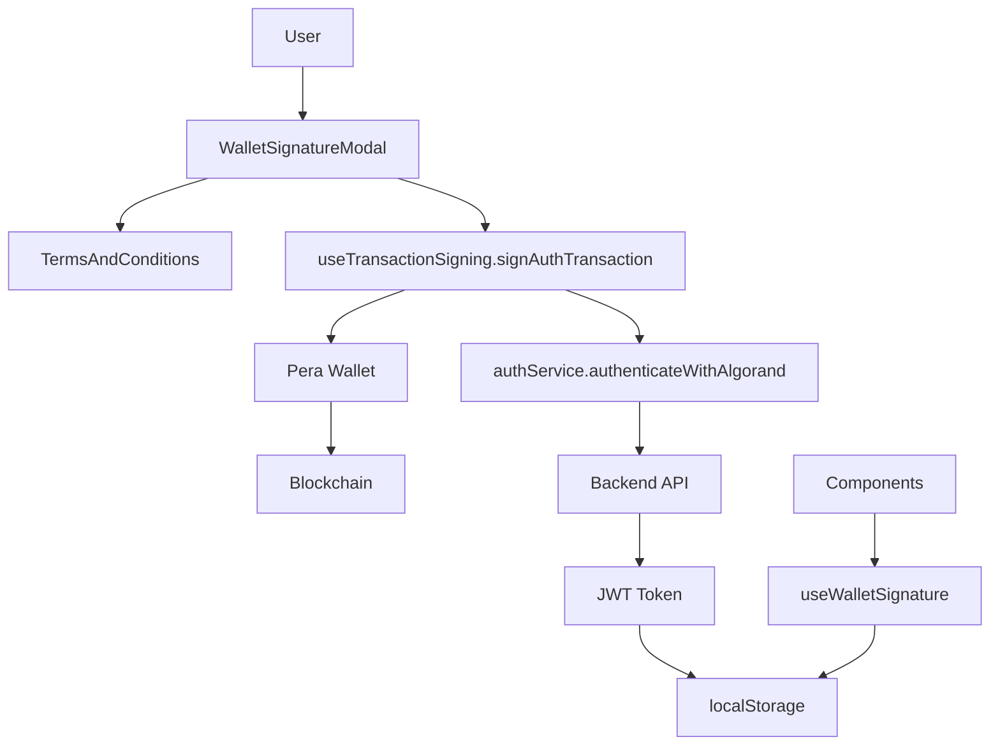
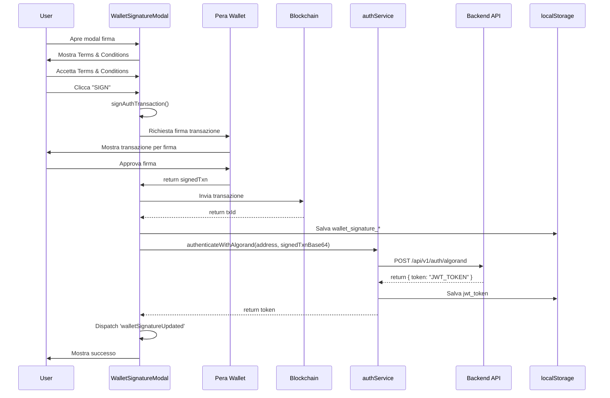

# 🔐 Autenticazione JWT con Backend API

Documentazione completa dell'integrazione con il backend API per l'autenticazione JWT tramite firma transazione Algorand. Questo sistema permette agli utenti di autenticarsi con il backend firmando una transazione blockchain che dimostra la proprietà del wallet.

## 🚀 Panoramica

Il sistema di autenticazione JWT utilizza una transazione Algorand firmata per dimostrare la proprietà del wallet e ottenere un token JWT dal backend. Questo approccio combina la sicurezza blockchain con l'autenticazione tradizionale basata su token.

### ✨ Vantaggi Principali

- **🔒 Blockchain-Based Authentication**: Autenticazione basata su firma transazione blockchain
- **📝 Terms & Conditions**: Accettazione esplicita termini con firma immutabile
- **🎫 JWT Token**: Token standard per autenticazione API
- **🔄 Session Management**: Gestione sessioni con token persistente
- **🛡️ Security**: Nessuna password, solo controllo chiavi private wallet

## 🏗️ Architettura Integrazione

### **Stack Tecnologico**

```typescript
Backend Integration:
├── authService.ts              # Servizio comunicazione backend
├── useWalletSignature.ts       # Hook gestione stato firma
├── WalletSignatureModal.tsx    # UI per firma Terms & Conditions
├── TermsAndConditions.tsx     # Componente Termini e Condizioni
└── useTransactionSigning.ts   # Hook firma transazione autenticazione

Backend API:
├── POST /api/v1/auth/algorand  # Endpoint autenticazione
├── Request: { address, signedTxnBase64 }
└── Response: { token: string }
```

### **Componenti Architettura**



## 🔧 Implementazione Dettagliata

### **1. authService - Core Service**

Il servizio principale gestisce la comunicazione con il backend API:

```typescript
// src/services/authService.ts
import axios, { type AxiosResponse } from 'axios';
import { config } from '../config/environment';

export interface AlgorandAuthRequest {
  address: string;
  signedTxnBase64: string;
}

export interface AlgorandAuthResponse {
  token: string;
}

class AuthService {
  private getBaseUrl(): string {
    return config.api?.baseUrl || '';
  }

  /**
   * Authenticate with Algorand wallet signature
   * Sends the signed transaction to the backend to receive a JWT token
   */
  async authenticateWithAlgorand(
    address: string,
    signedTxnBase64: string
  ): Promise<string> {
    const baseUrl = this.getBaseUrl();
    
    if (!baseUrl) {
      throw new Error('API base URL not configured. Please set VITE_API_BASE_URL in your .env file.');
    }

    const requestBody: AlgorandAuthRequest = {
      address,
      signedTxnBase64
    };

    const response: AxiosResponse<AlgorandAuthResponse> = await axios.post(
      `${baseUrl}/api/v1/auth/algorand`,
      requestBody,
      {
        headers: {
          'Content-Type': 'application/json'
        },
        timeout: 30000
      }
    );

    if (!response.data?.token) {
      throw new Error('Invalid response from server: token not found');
    }

    return response.data.token;
  }

  /**
   * Save JWT token to localStorage
   */
  saveToken(token: string): void {
    localStorage.setItem('jwt_token', token);
  }

  /**
   * Get JWT token from localStorage
   */
  getToken(): string | null {
    return localStorage.getItem('jwt_token');
  }

  /**
   * Remove JWT token from localStorage
   */
  clearToken(): void {
    localStorage.removeItem('jwt_token');
  }

  /**
   * Check if a token exists
   */
  hasToken(): boolean {
    return this.getToken() !== null;
  }
}

export const authService = new AuthService();
```

### **2. useTransactionSigning.signAuthTransaction**

Metodo per firmare la transazione di autenticazione:

```typescript
// src/hooks/useTransactionSigning.ts
const signAuthTransaction = async (): Promise<{ signedTxBase64: string; txId: string }> => {
  if (!isConnected || !accountAddress) {
    throw new Error('Pera Wallet not connected');
  }

  // Create Algod client
  const algodClient = new algosdk.Algodv2(
    config.algod.token,
    config.algod.server,
    config.algod.port
  );

  // Get suggested parameters
  const suggestedParams = await algodClient.getTransactionParams().do();

  // Create auth note JSON (matching backend format)
  const authNote = {
    domain: typeof window !== 'undefined' ? window.location.origin : '',
    nonce: crypto.randomUUID(),
    timestamp: Math.floor(Date.now() / 1000), // epoch seconds
    expirySeconds: 1000
  };
  const noteJson = JSON.stringify(authNote);

  // Create payment transaction: 0 Algo, receiver = sender (self)
  const txn = algosdk.makePaymentTxnWithSuggestedParamsFromObject({
    sender: accountAddress,
    receiver: accountAddress, // Self transaction
    amount: 0, // 0 Algo
    note: new Uint8Array(Buffer.from(noteJson)),
    suggestedParams
  });

  // Sign with Pera Wallet
  const signedTxns = await signTransaction([txGroup]);
  const signedTxn = signedTxns[0];

  // Encode signed transaction to base64
  const signedTxBase64 = Buffer.from(signedTxn).toString('base64');

  // Send transaction to blockchain
  const result = await algodClient.sendRawTransaction(signedTxn).do();
  const txId = result.txid;

  return { signedTxBase64, txId };
};
```

### **3. WalletSignatureModal - UI Component**

Componente modal per gestire la firma dei Terms & Conditions:

```typescript
// src/components/modals/WalletSignatureModal.tsx
export const WalletSignatureModal: React.FC<WalletSignatureModalProps> = ({
  isOpen,
  onClose,
  walletAddress
}) => {
  const { signAuthTransaction, isSigning } = useTransactionSigning();
  const [acceptedTerms, setAcceptedTerms] = useState(false);
  const [isAuthenticating, setIsAuthenticating] = useState(false);
  const [isSigned, setIsSigned] = useState(false);

  // Reset state when modal closes
  useEffect(() => {
    if (!isOpen) {
      setIsSigned(false);
      setAcceptedTerms(false);
      setIsAuthenticating(false);
    }
  }, [isOpen]);

  const handleSign = async () => {
    if (!acceptedTerms) {
      setError('È necessario accettare i Termini e Condizioni per procedere');
      return;
    }

    try {
      // Sign authentication transaction
      const result = await signAuthTransaction();

      if (result.txId && result.signedTxBase64) {
        // Save signature status
        localStorage.setItem(`wallet_signature_${walletAddress}`, 'true');
        localStorage.setItem(`wallet_signature_tx_${walletAddress}`, result.txId);
        localStorage.setItem(`wallet_signature_base64_${walletAddress}`, result.signedTxBase64);
        
        // Authenticate with backend to get JWT token
        setIsAuthenticating(true);
        try {
          const jwtToken = await authService.authenticateWithAlgorand(
            walletAddress,
            result.signedTxBase64
          );
          
          // Save JWT token (overwrites previous token if exists)
          authService.saveToken(jwtToken);
          
          setIsSigned(true);
        } catch (authError) {
          // Transaction is on blockchain, but auth failed
          setIsSigned(true);
          setError(`Transazione firmata, ma autenticazione fallita: ${authError.message}`);
        } finally {
          setIsAuthenticating(false);
        }
        
        // Dispatch event to notify other components
        window.dispatchEvent(new Event('walletSignatureUpdated'));
      }
    } catch (err) {
      setError(formatErrorMessage(err));
    }
  };

  return (
    <Modal isOpen={isOpen} onClose={onClose} title="Conferma Proprietà Wallet">
      {/* Terms and Conditions */}
      <TermsAndConditions walletAddress={walletAddress} />
      
      {/* Checkbox accettazione */}
      <input
        type="checkbox"
        checked={acceptedTerms}
        onChange={(e) => setAcceptedTerms(e.target.checked)}
      />
      
      {/* Sign button */}
      <Button
        onClick={handleSign}
        loading={isSigning || isAuthenticating}
        disabled={!acceptedTerms}
      >
        SIGN
      </Button>
    </Modal>
  );
};
```

### **4. useWalletSignature Hook**

Hook per verificare lo stato della firma:

```typescript
// src/hooks/useWalletSignature.ts
export const useWalletSignature = () => {
  const { userAddress } = useAuth();
  const [hasSigned, setHasSigned] = useState(false);
  const [signedTxBase64, setSignedTxBase64] = useState<string | null>(null);
  const [signedTxId, setSignedTxId] = useState<string | null>(null);

  const checkSignature = useCallback(() => {
    if (!userAddress) {
      setHasSigned(false);
      return;
    }

    const signatureStatus = localStorage.getItem(`wallet_signature_${userAddress}`);
    const base64 = localStorage.getItem(`wallet_signature_base64_${userAddress}`);
    const txId = localStorage.getItem(`wallet_signature_tx_${userAddress}`);

    setHasSigned(signatureStatus === 'true');
    setSignedTxBase64(base64);
    setSignedTxId(txId);
  }, [userAddress]);

  useEffect(() => {
    checkSignature();

    // Listen for storage changes (cross-tab)
    const handleStorageChange = (e: StorageEvent) => {
      if (e.key?.startsWith(`wallet_signature_${userAddress}`)) {
        checkSignature();
      }
    };

    window.addEventListener('storage', handleStorageChange);

    // Listen for custom event (same-tab)
    const handleSignatureUpdate = () => {
      checkSignature();
    };

    window.addEventListener('walletSignatureUpdated', handleSignatureUpdate);

    return () => {
      window.removeEventListener('storage', handleStorageChange);
      window.removeEventListener('walletSignatureUpdated', handleSignatureUpdate);
    };
  }, [userAddress, checkSignature]);

  return {
    hasSigned,
    signedTxBase64,
    signedTxId,
    refresh: checkSignature
  };
};
```

## 🔄 Flusso Autenticazione Completo

### **Sequence Diagram**



### **Step-by-Step Process**

1. **📋 User Action**: Utente tenta azione che richiede autenticazione
2. **🔍 Check Signature**: Sistema verifica se utente ha già firmato
3. **🪟 Show Modal**: Se non firmato, mostra WalletSignatureModal
4. **📜 Terms Display**: Mostra Terms & Conditions completi
5. **✅ User Acceptance**: Utente deve accettare esplicitamente
6. **🔏 Sign Transaction**: Firma transazione 0 Algo con nota JSON
7. **📤 Send to Blockchain**: Transazione inviata alla blockchain
8. **💾 Save Signature**: Salva stato firma in localStorage
9. **🌐 Authenticate Backend**: Invia signedTxnBase64 al backend
10. **🎫 Receive JWT**: Backend verifica e restituisce JWT token
11. **💾 Save Token**: JWT token salvato in localStorage
12. **🔄 Update State**: Componenti aggiornati tramite eventi

## 🎨 User Experience

### **WalletSignatureModal Flow**

**Stato Iniziale:**
- Mostra Terms & Conditions scrollabili
- Checkbox accettazione non selezionata
- Bottone "SIGN" disabilitato

**Dopo Accettazione:**
- Checkbox selezionata
- Bottone "SIGN" abilitato
- Utente può procedere con la firma

**Durante Firma:**
- Mostra "Firma in corso..."
- Bottone disabilitato
- Indicatore di caricamento

**Durante Autenticazione:**
- Mostra "Autenticazione con il server..."
- Indicatore di caricamento blu

**Successo:**
- Mostra schermata successo con Transaction ID
- Mostra signedTxBase64 (copiabile)
- Bottone "Continua" per chiudere

**Errore:**
- Mostra messaggio errore formattato
- Permette retry
- Se transazione firmata ma auth fallita, mostra warning ma permette continuare

### **Error Handling UX**

```typescript
// Messaggi errore user-friendly
const errorMessages = {
  'insufficient_funds': 'Il tuo wallet non ha abbastanza fondi per pagare la fee di transazione.',
  'network_error': 'Errore di rete durante l\'invio della transazione. Verifica la connessione e riprova.',
  'auth_failed': 'Autenticazione fallita: la firma della transazione non è valida',
  'server_error': 'Errore del server. Riprova più tardi.',
  'no_base_url': 'API base URL non configurato. Configura VITE_API_BASE_URL nel file .env'
};
```

## 🔒 Sicurezza e Best Practices

### **Security Model**

- **✅ Blockchain Verification**: Backend verifica la firma della transazione
- **✅ Domain Validation**: Nota transazione include dominio per prevenire replay attacks
- **✅ Nonce Protection**: Nonce univoco per ogni richiesta
- **✅ Timestamp Validation**: Backend verifica timestamp per prevenire replay
- **✅ JWT Storage**: Token salvato in localStorage (considerare httpOnly cookies in futuro)

### **Best Practices Implementate**

```typescript
// 1. Transaction Note Format
const authNote = {
  domain: window.location.origin,  // Previene replay da altri domini
  nonce: crypto.randomUUID(),      // Previene replay attacks
  timestamp: Math.floor(Date.now() / 1000),  // Epoch seconds
  expirySeconds: 1000              // Validità 1000 secondi
};

// 2. Error Handling
try {
  const token = await authService.authenticateWithAlgorand(address, signedTxnBase64);
  authService.saveToken(token);
} catch (error) {
  // Transaction is on blockchain, but auth failed
  // Still mark as signed to allow retry
  setIsSigned(true);
  setError(`Autenticazione fallita: ${error.message}`);
}

// 3. Token Management
// Token viene sovrascritto ad ogni nuova firma
authService.saveToken(newToken);  // Overwrites previous token

// 4. State Reset
// Modal resetta stato quando chiuso
useEffect(() => {
  if (!isOpen) {
    setIsSigned(false);
    setAcceptedTerms(false);
    // ... reset all state
  }
}, [isOpen]);
```

## ⚙️ Configurazione

### **Environment Variables**

```bash
# Backend API Base URL (OPZIONALE - Richiesto per autenticazione JWT)
VITE_API_BASE_URL=http://localhost:8088  # URL del backend API

# Esempi:
# Sviluppo locale: http://localhost:8088
# Staging: https://api-staging.example.com
# Produzione: https://api.example.com
```

### **Backend API Endpoint**

```typescript
// Endpoint: POST {{baseUrl}}/api/v1/auth/algorand

// Request Body:
{
  "address": "ALGORAND_ADDRESS",
  "signedTxnBase64": "BASE64_SIGNED_TRANSACTION"
}

// Response:
{
  "token": "JWT_TOKEN_STRING"
}

// Error Responses:
// 400: Bad Request - Invalid request format
// 401: Unauthorized - Invalid signature
// 500: Server Error - Internal server error
```

## 🧪 Testing e Debugging

### **Test Workflow Completo**

```bash
# 1. Configura backend URL
echo "VITE_API_BASE_URL=http://localhost:8088" >> .env.local

# 2. Avvia applicazione
npm run dev

# 3. Test autenticazione:
# - Connetti Pera Wallet
# - Tenta azione che richiede firma
# - Verifica modal Terms & Conditions
# - Firma transazione
# - Verifica JWT token salvato in localStorage
```

### **Debug Tools**

```typescript
// Verifica stato firma
const { hasSigned, signedTxBase64, signedTxId } = useWalletSignature();
// Has Signed: hasSigned
// Transaction ID: signedTxId

// Verifica JWT token
const token = authService.getToken();
// JWT Token: token ? 'Present' : 'Missing'

// Verifica localStorage
// All signature keys: Object.keys(localStorage).filter(k => k.startsWith('wallet_signature_'))
```

### **Common Issues**

| Problema | Soluzione |
|----------|-----------|
| **Modal non si resetta** | Verifica useEffect con dipendenza `isOpen` |
| **JWT non salvato** | Verifica che backend risponda con `{ token: "..." }` |
| **Auth fallisce** | Verifica formato transazione e nota JSON |
| **Cross-tab non sincronizza** | Verifica event listener 'storage' e 'walletSignatureUpdated' |

## 📊 Utilizzo in Componenti

### **Protezione Azioni**

```tsx
// Esempio: DashboardPage
const DashboardPage: React.FC = () => {
  const { hasSigned } = useWalletSignature();
  const [isSignatureModalOpen, setIsSignatureModalOpen] = useState(false);

  return (
    <div>
      {hasSigned ? (
        <Link to="/certificates">Crea Certificazione</Link>
      ) : (
        <button onClick={() => setIsSignatureModalOpen(true)}>
          Crea Certificazione
        </button>
      )}

      <WalletSignatureModal
        isOpen={isSignatureModalOpen}
        onClose={() => setIsSignatureModalOpen(false)}
        walletAddress={userAddress}
      />
    </div>
  );
};
```

### **Utilizzo JWT Token**

```typescript
// In future API calls, include JWT token
const makeAuthenticatedRequest = async (url: string, options: RequestInit = {}) => {
  const token = authService.getToken();
  
  if (!token) {
    throw new Error('Not authenticated');
  }

  return fetch(url, {
    ...options,
    headers: {
      ...options.headers,
      'Authorization': `Bearer ${token}`
    }
  });
};
```

## 🔮 Future Enhancements

### **Prossimi Miglioramenti**

- [ ] **Token Refresh**: Implementare refresh automatico token JWT
- [ ] **HttpOnly Cookies**: Spostare storage token da localStorage a httpOnly cookies
- [ ] **Token Expiry**: Gestione scadenza token e rinnovo automatico
- [ ] **Multi-Wallet Support**: Supporto per più wallet con token separati
- [ ] **Offline Mode**: Cache token per utilizzo offline

---

## 📞 Supporto

Per supporto specifico su autenticazione JWT:

- **📚 Backend API Docs**: Consulta documentazione backend per endpoint `/api/v1/auth/algorand`
- **🛠️ GitHub Issues**: Repository issues per bug report e feature request
- **📧 Support**: [info@artcertify.com](mailto:info@artcertify.com)

**🔐 Autenticazione JWT - Sicurezza blockchain con token standard per CaputMundi ArtCertify!**

