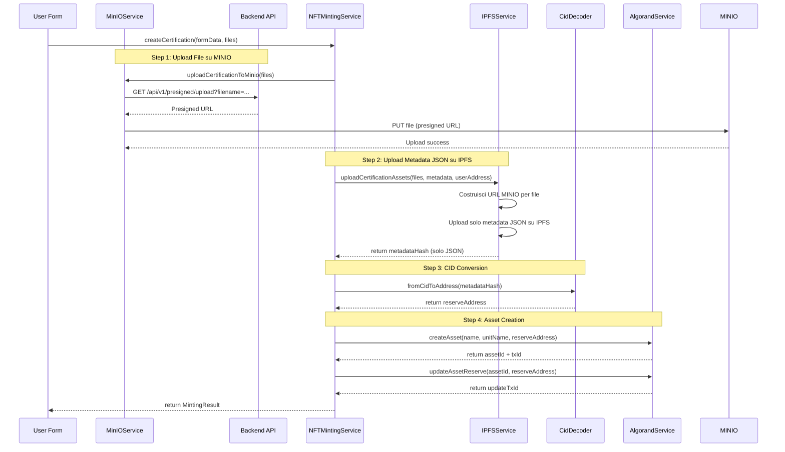

# 🎨 NFT Minting Service

Documentazione completa del servizio di minting NFT per ArtCertify, che implementa la creazione di certificazioni digitali soulbound su blockchain Algorand con storage ibrido MINIO + IPFS.

## 📋 Panoramica

Il NFT Minting Service fornisce:
- **Creazione NFT soulbound** non trasferibili per certificazioni
- **Upload automatico MINIO** per file certificazioni (presigned URLs)
- **Upload automatico IPFS** per metadata JSON solamente
- **Integrazione CID decoder** per conversione address ↔ CID
- **Gestione versioning** per aggiornamenti certificazioni
- **Validazione completa** di dati e transazioni
- **Supporto legacy** per organizzazioni (file su IPFS)

## 🏗️ Architettura

### Flusso Completo di Minting (Certificazioni - MINIO + IPFS)



### Componenti Principali

```typescript
// Servizio principale
class NFTMintingService {
  // Creazione certificazioni
  createDocumentCertification(data: DocumentData, files: File[]): Promise<MintingResult>
  createArtifactCertification(data: ArtifactData, files: File[]): Promise<MintingResult>
  
  // Gestione asset
  updateAssetReserve(params: UpdateReserveParams): Promise<UpdateResult>
  validateCertification(assetId: number): Promise<ValidationResult>
  
  // Utilità
  prepareCertificationData(formData: any, files: File[]): CertificationData
}

// Integrazione servizi
interface ServiceDependencies {
  ipfsService: IPFSService;      // Solo per metadata JSON
  minioService: MinIOService;     // Per file certificazioni
  algorandService: AlgorandService;
  cidDecoder: CidDecoder;
}
```

## 🔧 Configurazione

### Variabili d'Ambiente

```bash
# Algorand Network
VITE_ALGORAND_NETWORK=testnet
VITE_ALGOD_SERVER=https://testnet-api.algonode.cloud
VITE_INDEXER_SERVER=https://testnet-idx.algonode.cloud

# Backend API (richiesto per MINIO presigned URLs)
VITE_API_BASE_URL=http://localhost:8088

# IPFS Configuration (solo per metadata JSON)
VITE_PINATA_GATEWAY=coffee-quiet-limpet-747.mypinata.cloud
VITE_PINATA_API_KEY=your_api_key
VITE_PINATA_API_SECRET=your_api_secret
VITE_PINATA_JWT=your_jwt_token

# Minting Configuration
VITE_PRIVATE_KEY_MNEMONIC=your_25_word_mnemonic_phrase
VITE_DEFAULT_CREATOR_ADDRESS=ALGORAND_ADDRESS_HERE
```

### Setup Servizio

```typescript
// src/services/nftMintingService.ts
import IPFSService from './ipfsService';
import { algorandService } from './algorand';
import { CidDecoder } from './cidDecoder';

export default class NFTMintingService {
  private ipfsService: IPFSService;
  private algorandService: typeof algorandService;
  private cidDecoder: typeof CidDecoder;

  constructor() {
    this.ipfsService = new IPFSService();
    this.algorandService = algorandService;
    this.cidDecoder = CidDecoder;
  }
}
```

## 🎯 Creazione Certificazioni

### Documento Certificazione

```typescript
interface DocumentCertificationData {
  // Dati Form
  documentName: string;
  description: string;
  authorName: string;
  date: string;
  documentType: 'tipologia' | 'altro';
  customType?: string;
  
  // Dati NFT
  assetName: string;
  unitName: string;
  
  // File
  files: File[];
  
  // Organizzazione
  organization: {
    name: string;
    code: string;
    type: string;
    city: string;
  };
}

const createDocumentCertification = async (
  data: DocumentCertificationData,
  userAddress: string  // Richiesto per costruire URL MINIO
): Promise<MintingResult> => {
  // 1. Validazione dati
  validateCertificationData(data);
  
  // 2. Upload file su MINIO (già fatto nella pagina "Nuova Certificazione")
  // I file vengono caricati PRIMA tramite MinIOService.uploadCertificationToMinio()
  
  // 3. Preparazione metadata
  const certificationData = prepareCertificationData(data);
  
  // 4. Upload solo metadata JSON su IPFS (con URL MINIO nel JSON)
  const ipfsResult = await this.ipfsService.uploadCertificationAssets(
    data.files,  // Usato solo per costruire URL MINIO, non caricati su IPFS
    certificationData,
    data,
    userAddress  // Per costruire URL MINIO
  );
  
  // 5. Conversione CID metadata → reserve address
  const reserveAddress = this.cidDecoder.fromCidToAddress(ipfsResult.metadataHash);
  
  // 6. Creazione asset NFT
  const createResult = await this.algorandService.createAsset({
    assetName: data.assetName,
    unitName: data.unitName,
    total: 1,
    decimals: 0,
    defaultFrozen: false,
    manager: creatorAddress,
    reserve: creatorAddress, // Temporaneo
    freeze: creatorAddress,
    clawback: creatorAddress,
    url: ipfsResult.metadataUrl,
    metadataHash: undefined,
    note: `ArtCertify certification: ${data.documentName}`
  });
  
  // 7. Aggiornamento reserve address con CID
  const updateResult = await this.algorandService.updateAssetReserve({
    assetId: createResult.assetId,
    newReserveAddress: reserveAddress,
    managerMnemonic: mnemonic
  });
  
  return {
    assetId: createResult.assetId,
    txId: createResult.txId,
    updateTxId: updateResult.txId,
    confirmedRound: updateResult.confirmedRound,
    metadataUrl: ipfsResult.metadataUrl,
    ipfsHashes: {
      metadata: ipfsResult.metadataHash,  // Solo hash del JSON
      files: ipfsResult.fileHashes  // Hash vuoto per file MINIO
    },
    finalReserveAddress: reserveAddress
  };
};
```

### Artefatto Certificazione

```typescript
interface ArtifactCertificationData {
  // Tipo artefatto
  artifactType: 'artefatto-digitale' | 'video' | 'modello-3d' | 'altro';
  
  // Campi comuni
  uniqueId: string;
  title: string;
  description: string;
  author: string;
  creationDate: string;
  
  // Dati NFT
  assetName: string;
  unitName: string;
  
  // Campi specifici per tipo
  [key: string]: any;
  
  // File
  files: File[];
}

const createArtifactCertification = async (
  data: ArtifactCertificationData
): Promise<MintingResult> => {
  // Processo simile a documento ma con metadata specifici
  const certificationData = {
    asset_type: data.artifactType,
    unique_id: data.uniqueId,
    title: data.title,
    author: data.author,
    creation_date: data.creationDate,
    organization: data.organization,
    technical_specs: getTechnicalSpecs(data)
  };
  
  // Resto del processo identico
  // ...
};
```

## 📄 Struttura Metadata IPFS

### Metadata Standard ARC-3 (Certificazioni - MINIO + IPFS)

```json
{
  "name": "Certificazione Documento - Contratto Affitto",
  "description": "Certificazione digitale per documento legale verificato",
  "image": "https://s3.caputmundi.artcertify.com/vs6jshyleixfflv57zj2idaysrg2fir3zi4jdyrv4vzwdnzosgv5jdamui/contratto_affitto.pdf",
  "external_url": "https://artcertify.com/cert/12345",
  "attributes": [
    {
      "trait_type": "Tipo Certificazione",
      "value": "Documento"
    },
    {
      "trait_type": "Organizzazione",
      "value": "Studio Legale Roma"
    },
    {
      "trait_type": "Data Certificazione", 
      "value": "2024-01-15"
    },
    {
      "trait_type": "Autore",
      "value": "Mario Rossi"
    },
    {
      "trait_type": "Tipo Documento",
      "value": "Contratto"
    }
  ],
  "properties": {
    // Dati form originali
    "form_data": {
      "documentName": "Contratto Affitto",
      "description": "Contratto di affitto appartamento",
      "authorName": "Mario Rossi",
      "date": "2024-01-15",
      "documentType": "contratto",
      "assetName": "SBT_Contratto_001",
      "unitName": "CERT",
      "timestamp": "2024-01-15T10:30:00Z"
    },
    
    // Metadata file MINIO (per certificazioni)
    "files_metadata": [
      {
        "name": "contratto_affitto.pdf",
        "s3StorageUrl": "https://s3.caputmundi.artcertify.com/vs6jshyleixfflv57zj2idaysrg2fir3zi4jdyrv4vzwdnzosgv5jdamui/contratto_affitto.pdf",
        "gatewayUrl": "https://s3.caputmundi.artcertify.com/vs6jshyleixfflv57zj2idaysrg2fir3zi4jdyrv4vzwdnzosgv5jdamui/contratto_affitto.pdf"
      },
      {
        "name": "allegato_planimetria.png", 
        "s3StorageUrl": "https://s3.caputmundi.artcertify.com/vs6jshyleixfflv57zj2idaysrg2fir3zi4jdyrv4vzwdnzosgv5jdamui/allegato_planimetria.png",
        "gatewayUrl": "https://s3.caputmundi.artcertify.com/vs6jshyleixfflv57zj2idaysrg2fir3zi4jdyrv4vzwdnzosgv5jdamui/allegato_planimetria.png"
      }
    ],
    
    // Info storage (MINIO per certificazioni)
    "storage_info": {
      "uploaded_at": "2024-01-15T10:30:00Z",
      "total_files": 2,
      "storage_type": "minio",
      "base_url": "https://s3.caputmundi.artcertify.com"
    },
    
    // Dati certificazione
    "certification_data": {
      "asset_type": "document",
      "unique_id": "DOC-2024-001",
      "title": "Contratto Affitto",
      "author": "Mario Rossi",
      "creation_date": "2024-01-15",
      "organization": {
        "name": "Studio Legale Roma",
        "code": "SLR001", 
        "type": "Studio Legale",
        "city": "Roma"
      },
      "files": [
        {
          "name": "contratto_affitto.pdf",
          "hash": "QmFileHash1",
          "type": "application/pdf",
          "size": 245760
        }
      ]
    }
  }
}
```

### Preparazione Metadata

```typescript
const prepareCertificationMetadata = (
  formData: any,
  certificationData: any,
  fileHashes: FileHash[]
): IPFSMetadata => {
  return {
    name: certificationData?.title || String(formData.assetName || 'Certified Asset'),
    description: String(formData.description),
    image: fileHashes.length > 0 ? `ipfs://${fileHashes[0].hash}` : '',
    external_url: `https://artcertify.com/cert/${certificationData?.unique_id}`,
    animation_url: fileHashes.find(f => f.type === 'application/pdf')?.ipfsUrl || '',
    
    attributes: [
      {
        trait_type: 'Asset Type',
        value: certificationData?.asset_type || 'Unknown'
      },
      {
        trait_type: 'Author',
        value: certificationData?.author || 'Unknown'
      },
      {
        trait_type: 'Creation Date',
        value: certificationData?.creation_date || 'Unknown'
      },
      {
        trait_type: 'Organization',
        value: certificationData?.organization?.name || 'Unknown'
      },
      {
        trait_type: 'Asset Name',
        value: formData.assetName || 'Unknown'
      },
      {
        trait_type: 'Unit Name',
        value: formData.unitName || 'Unknown'
      }
    ],
    
    properties: {
      form_data: {
        ...formData,
        timestamp: new Date().toISOString()
      },
      files_metadata: fileHashes.map(file => ({
        name: file.name,
        ipfsUrl: file.ipfsUrl,
        gatewayUrl: file.gatewayUrl
      })),
      ipfs_info: {
        uploaded_at: new Date().toISOString(),
        total_files: fileHashes.length,
        gateway: import.meta.env.VITE_PINATA_GATEWAY
      },
      certification_data: certificationData
    }
  };
};
```

## 🔐 CID Decoder Integration

### Conversione CID → Reserve Address

Il sistema utilizza lo standard ARC-0019 per convertire CID IPFS in indirizzi Algorand:

```typescript
// src/services/cidDecoder.ts
export class CidDecoder {
  /**
   * Converte CID IPFS in indirizzo Algorand per reserve address
   */
  static fromCidToAddress(cid: string): string {
    try {
      // Decodifica CID
      const decoded = CID.parse(cid);
      
      // Estrae multihash
      const multihash = decoded.multihash;
      
      // Converte in address Algorand (32 byte + checksum)
      const algorandAddress = this.multihashToAlgorandAddress(multihash);
      
      return algorandAddress;
    } catch (error) {
      throw new Error(`Failed to convert CID to address: ${error.message}`);
    }
  }
  
  /**
   * Converte indirizzo Algorand in CID IPFS
   */
  static fromAddressToCid(address: string): string {
    try {
      // Decodifica address Algorand
      const decoded = algosdk.decodeAddress(address);
      
      // Converte in multihash
      const multihash = this.algorandAddressToMultihash(decoded.publicKey);
      
      // Crea CID v1
      const cid = CID.createV1(0x55, multihash); // 0x55 = raw codec
      
      return cid.toString();
    } catch (error) {
      throw new Error(`Failed to convert address to CID: ${error.message}`);
    }
  }
}
```

### Utilizzo nel Minting

```typescript
const updateAssetWithCID = async (assetId: number, metadataCID: string) => {
  // 1. Converte CID metadata in address
  const reserveAddress = CidDecoder.fromCidToAddress(metadataCID);
  
  // 2. Aggiorna asset con nuovo reserve address
  const updateParams = {
    assetId,
    newReserveAddress: reserveAddress,
    managerMnemonic: mnemonic,
    metadataUrl: `ipfs://${metadataCID}`
  };
  
  const result = await algorandService.updateAssetReserve(updateParams);
  
  // 3. Verifica conversione inversa
  const convertedCID = CidDecoder.fromAddressToCid(reserveAddress);
  // CID conversion verified: convertedCID === metadataCID
  
  return result;
};
```

## 📊 Risultati Minting

### MintingResult Interface

```typescript
interface MintingResult {
  // Asset blockchain
  assetId: number;
  txId: string;
  updateTxId?: string;
  confirmedRound: number;
  
  // IPFS data
  metadataUrl: string;
  ipfsHashes: {
    metadata: string;
    files: Array<{
      name: string;
      hash: string;
      type: string;
      size: number;
    }>;
  };
  
  // CID conversion
  finalReserveAddress: string;
  
  // Timing
  createdAt: string;
  processingTime: number;
}
```

### Esempio Risultato Completo

```json
{
  "assetId": 741518034,
  "txId": "ABCD1234TXID",
  "updateTxId": "EFGH5678UPDATETXID", 
  "confirmedRound": 32847291,
  "metadataUrl": "ipfs://QmYourMetadataHash",
  "ipfsHashes": {
    "metadata": "QmYourMetadataHash",
    "files": [
      {
        "name": "document.pdf",
        "hash": "QmFileHash1", 
        "type": "application/pdf",
        "size": 245760
      },
      {
        "name": "attachment.png",
        "hash": "QmFileHash2",
        "type": "image/png", 
        "size": 89432
      }
    ]
  },
  "finalReserveAddress": "KYN4QYQC...3JNM",
  "createdAt": "2024-01-15T10:30:00Z",
  "processingTime": 12500
}
```

## 🔄 Gestione Versioning

### Aggiornamento Certificazioni

```typescript
interface VersioningInfo {
  currentVersion: number;
  previousVersion: {
    version: number;
    cid: string;
    reserveAddress: string;
    ipfsLink: string;
  };
  nextVersion: number;
}

const updateCertification = async (
  assetId: number,
  newData: any,
  newFiles: File[],
  userAddress: string,  // Richiesto per costruire URL MINIO
  existingJson: any  // JSON esistente con file MINIO
): Promise<UpdateResult> => {
  // 1. Recupera info versioning esistente
  const asset = await algorandService.getAssetInfo(assetId);
  const currentCID = CidDecoder.fromAddressToCid(asset.params.reserve);
  
  // 2. Upload nuovi file su MINIO (se presenti)
  if (newFiles.length > 0) {
    const minioService = new MinIOService();
    await minioService.uploadCertificationToMinio(newFiles);
  }
  
  // 3. Prepara nuova versione
  const versionInfo: VersioningInfo = {
    currentVersion: getCurrentVersion(asset),
    previousVersion: {
      version: getCurrentVersion(asset),
      cid: currentCID,
      reserveAddress: asset.params.reserve,
      ipfsLink: `https://${process.env.VITE_PINATA_GATEWAY}/ipfs/${currentCID}`
    },
    nextVersion: getCurrentVersion(asset) + 1
  };
  
  // 4. Costruisci JSON aggiornato con URL MINIO per nuovi file
  // I file esistenti vengono letti da existingJson (già su MINIO)
  // I nuovi file vengono aggiunti con URL MINIO
  const updatedJson = {
    ...existingJson,
    ...newData,
    version_info: versionInfo,
    modification_timestamp: new Date().toISOString(),
    previous_cid: currentCID
  };
  
  // 5. Upload solo metadata JSON su IPFS (con URL MINIO nel JSON)
  const ipfsResult = await ipfsService.uploadCertificationVersion(
    newFiles,  // Usato solo per costruire URL MINIO
    updatedJson,
    newData,
    userAddress  // Per costruire URL MINIO
  );
  const newReserveAddress = CidDecoder.fromCidToAddress(ipfsResult.metadataHash);
  
  // 6. Aggiorna asset
  return await algorandService.updateAssetReserve({
    assetId,
    newReserveAddress,
    managerMnemonic: mnemonic,
    metadataUrl: `ipfs://${ipfsResult.metadataHash}`
  });
};
```

## ✅ Validazione e Testing

### Validazione Certificazione

```typescript
interface ValidationResult {
  isValid: boolean;
  errors: string[];
  warnings: string[];
  assetInfo: AssetInfo;
  metadataInfo: any;
  cidInfo: {
    isValidCID: boolean;
    conversionMatch: boolean;
    originalCID: string;
    convertedAddress: string;
  };
}

const validateCertification = async (assetId: number): Promise<ValidationResult> => {
  const errors: string[] = [];
  const warnings: string[] = [];
  
  try {
    // 1. Verifica asset existence
    const asset = await algorandService.getAssetInfo(assetId);
    
    // 2. Verifica caratteristiche soulbound
    if (asset.params.total !== 1) {
      errors.push('Asset should have total supply = 1');
    }
    
    if (asset.params.clawback !== asset.params.creator) {
      errors.push('Asset should have clawback = creator');
    }
    
    // 3. Verifica reserve address → CID conversion
    let cidInfo = null;
    try {
      const originalCID = CidDecoder.fromAddressToCid(asset.params.reserve);
      const convertedAddress = CidDecoder.fromCidToAddress(originalCID);
      
      cidInfo = {
        isValidCID: true,
        conversionMatch: convertedAddress === asset.params.reserve,
        originalCID,
        convertedAddress
      };
      
      if (!cidInfo.conversionMatch) {
        errors.push('CID ↔ Address conversion mismatch');
      }
    } catch (error) {
      cidInfo = {
        isValidCID: false,
        conversionMatch: false,
        originalCID: '',
        convertedAddress: ''
      };
      errors.push(`Invalid CID conversion: ${error.message}`);
    }
    
    // 4. Verifica metadata IPFS
    let metadataInfo = null;
    if (asset.params.url?.startsWith('ipfs://')) {
      try {
        const metadataHash = asset.params.url.replace('ipfs://', '');
        metadataInfo = await ipfsService.fetchMetadata(metadataHash);
        
        if (!metadataInfo.name) warnings.push('Missing metadata name');
        if (!metadataInfo.description) warnings.push('Missing metadata description');
      } catch (error) {
        errors.push(`Failed to fetch IPFS metadata: ${error.message}`);
      }
    } else {
      errors.push('Asset URL should be IPFS URL');
    }
    
    return {
      isValid: errors.length === 0,
      errors,
      warnings,
      assetInfo: asset,
      metadataInfo,
      cidInfo
    };
    
  } catch (error) {
    return {
      isValid: false,
      errors: [`Failed to validate asset: ${error.message}`],
      warnings,
      assetInfo: null,
      metadataInfo: null,
      cidInfo: null
    };
  }
};
```

### Testing

```typescript
// Test asset di esempio
const TEST_ASSETS = {
  DOCUMENT_CERT: 741518034,
  ARTIFACT_CERT: 741234567,
  INVALID_CERT: 999999999
};

describe('NFT Minting Service', () => {
  test('should create document certification successfully', async () => {
    const testData = {
      documentName: 'Test Document',
      description: 'Test Description', 
      authorName: 'Test Author',
      // ... altri campi
    };
    
    const result = await nftMintingService.createDocumentCertification(testData);
    
    expect(result.assetId).toBeGreaterThan(0);
    expect(result.metadataUrl).toMatch(/^ipfs:\/\/.+/);
    expect(result.finalReserveAddress).toMatch(/^[A-Z2-7]{58}$/);
  });
  
  test('should validate certification correctly', async () => {
    const result = await nftMintingService.validateCertification(TEST_ASSETS.DOCUMENT_CERT);
    
    expect(result.isValid).toBe(true);
    expect(result.cidInfo.conversionMatch).toBe(true);
    expect(result.errors).toHaveLength(0);
  });
});
```

## 🚀 Performance e Ottimizzazioni

### Upload Parallelizzato

```typescript
const uploadFilesInParallel = async (files: File[]): Promise<FileHash[]> => {
  // Upload file in batch di 3 per evitare rate limiting
  const BATCH_SIZE = 3;
  const results: FileHash[] = [];
  
  for (let i = 0; i < files.length; i += BATCH_SIZE) {
    const batch = files.slice(i, i + BATCH_SIZE);
    
    const batchPromises = batch.map(file => 
      ipfsService.uploadFile(file, {
        name: file.name,
        keyvalues: {
          batch: Math.floor(i / BATCH_SIZE).toString(),
          timestamp: new Date().toISOString()
        }
      })
    );
    
    const batchResults = await Promise.all(batchPromises);
    results.push(...batchResults);
    
    // Delay tra batch per rate limiting
    if (i + BATCH_SIZE < files.length) {
      await new Promise(resolve => setTimeout(resolve, 500));
    }
  }
  
  return results;
};
```

### Caching Metadata

```typescript
const metadataCache = new Map<string, { data: any; timestamp: number }>();
const CACHE_TTL = 5 * 60 * 1000; // 5 minuti

const getCachedMetadata = async (cid: string): Promise<any | null> => {
  const cached = metadataCache.get(cid);
  
  if (cached && Date.now() - cached.timestamp < CACHE_TTL) {
    return cached.data;
  }
  
  try {
    const metadata = await ipfsService.fetchMetadata(cid);
    metadataCache.set(cid, {
      data: metadata,
      timestamp: Date.now()
    });
    return metadata;
  } catch (error) {
    return null;
  }
};
```

## 📊 Monitoraggio

### Metriche Operative

- **Tempo medio minting**: ~15-30 secondi
- **Successo rate**: >95% 
- **Dimensione media metadata**: 2-5KB
- **File supportati**: PDF, PNG, JPG, DOC, DOCX
- **Limite file**: 50MB per file, 100MB totali

### Logging e Debugging

```typescript
const logMintingOperation = (operation: string, data: any, duration?: number) => {
  // Logging disabled - use monitoring service in production
  // Data available: timestamp, duration, network, gateway, ...data
};
```

---

**Documentazione completa NFT Minting Service per ArtCertify - Certificazioni digitali soulbound con IPFS storage**
