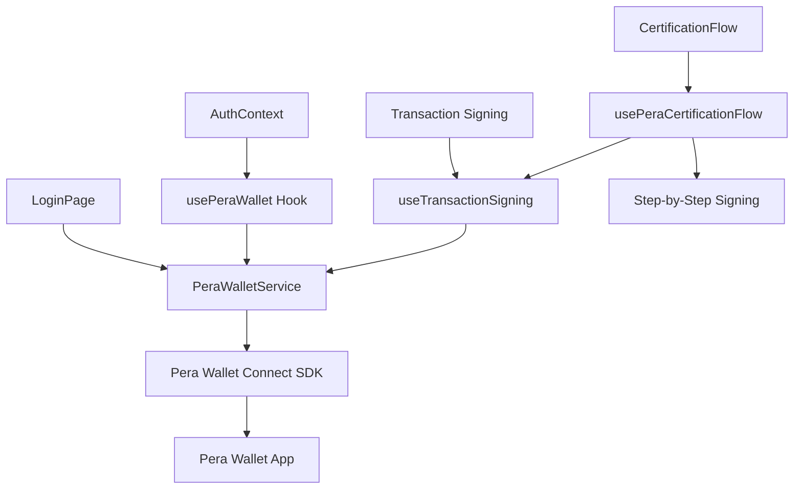

# 🔌 Integrazione Pera Wallet Connect

Documentazione completa dell'integrazione **Pera Wallet Connect** come unico metodo di autenticazione sicura per CaputMundi ArtCertify. Questa implementazione elimina la necessità di gestire chiavi private nell'applicazione, delegando la sicurezza al wallet dell'utente.

## 🚀 Panoramica

**Pera Wallet Connect** è la soluzione di connessione wallet ufficiale per l'ecosistema Algorand, che fornisce autenticazione sicura e firma transazioni senza esporre chiavi private. L'integrazione supporta sia mobile (QR Code) che desktop con esperienza utente ottimale.

### ✨ Vantaggi Principali

- **🔒 Zero Private Keys**: Nessuna chiave privata memorizzata nell'applicazione
- **📱 Multi-Platform**: Supporto mobile (QR Code) e desktop nativo
- **🔄 Session Persistence**: Riconnessione automatica tra sessioni browser
- **🛡️ Security-First**: Tutte le transazioni firmate dal wallet utente
- **⚡ UX Ottimale**: Connessione one-click con visual feedback
- **🎯 MINTER Role**: Ruolo sicuro per firma transazioni di certificazione

## 🏗️ Architettura Integrazione

### **Stack Tecnologico**

```typescript
Core Integration:
├── @perawallet/connect 1.4.2      # SDK ufficiale Pera Connect
├── algosdk 3.3.1                  # Algorand SDK per transazioni
├── React 19.1.0                   # Context e hooks per UI
└── TypeScript 5.8.3               # Type safety completa

Configurazione Automatica:
├── TestNet Chain ID: 416002       # Configurazione automatica
├── MainNet Chain ID: 416001       # Switch automatico
├── Explorer Integration            # Link diretti per verifiche
└── Network Validation             # Validazione parametri rete
```

### **Componenti Architettura**



## 🔧 Implementazione Dettagliata

### **1. PeraWalletService - Core Service**

Il servizio principale gestisce connessione, disconnessione e firma transazioni:

```typescript
// src/services/peraWalletService.ts
import { PeraWalletConnect } from '@perawallet/connect';
import algosdk from 'algosdk';

class PeraWalletService {
  private peraWallet: PeraWalletConnect;
  private connectedAccount: string | null = null;

  constructor() {
    this.peraWallet = new PeraWalletConnect({
      shouldShowSignTxnToast: false,
      chainId: config.network.chainId, // Auto-detection TestNet/MainNet
      compactMode: false
    });
  }

  // Connessione wallet (QR Code per mobile, direct per desktop)
  async connect(): Promise<string[]> {
    const accounts = await this.peraWallet.connect();
    if (accounts.length > 0) {
      this.connectedAccount = accounts[0];
      this.setupEventListeners();
      localStorage.setItem('pera_wallet_connected', 'true');
    }
    return accounts;
  }

  // Riconnessione automatica su page refresh
  async reconnectSession(): Promise<string[]> {
    try {
      const accounts = await this.peraWallet.reconnectSession();
      if (accounts.length > 0) {
        this.connectedAccount = accounts[0];
      }
      return accounts;
    } catch {
      return [];
    }
  }

  // Firma transazioni (MINTER role)
  async signTransaction(
    txGroups: SignerTransaction[][],
    signerAddress?: string
  ): Promise<Uint8Array[]> {
    if (!this.isConnected()) {
      throw new Error('Pera Wallet not connected');
    }
    
    return await this.peraWallet.signTransaction(
      txGroups,
      signerAddress || this.connectedAccount
    );
  }
}

export default new PeraWalletService();
```

### **2. usePeraWallet Hook - React Integration**

Hook React per gestione stato wallet e integrazione UI:

```typescript
// src/hooks/usePeraWallet.ts
export const usePeraWallet = () => {
  const [isConnected, setIsConnected] = useState(false);
  const [isConnecting, setIsConnecting] = useState(false);
  const [accountAddress, setAccountAddress] = useState<string | null>(null);
  const [platform, setPlatform] = useState<'mobile' | 'web' | null>(null);
  const [error, setError] = useState<string | null>(null);

  // Connessione wallet
  const connect = useCallback(async () => {
    setIsConnecting(true);
    setError(null);
    
    try {
      const accounts = await peraWalletService.connect();
      if (accounts.length > 0) {
        setAccountAddress(accounts[0]);
        setIsConnected(true);
        setPlatform(peraWalletService.peraWallet.platform);
      }
    } catch (error) {
      setError('Failed to connect wallet');
    } finally {
      setIsConnecting(false);
    }
  }, []);

  // Riconnessione automatica su mount
  useEffect(() => {
    const autoReconnect = async () => {
      const accounts = await peraWalletService.reconnectSession();
      if (accounts.length > 0) {
        setAccountAddress(accounts[0]);
        setIsConnected(true);
        setPlatform(peraWalletService.peraWallet.platform);
      }
    };
    
    autoReconnect();
  }, []);

  return {
    isConnected,
    isConnecting,
    accountAddress,
    platform,
    error,
    connect,
    disconnect,
    signTransaction: peraWalletService.signTransaction.bind(peraWalletService)
  };
};
```

### **3. AuthContext - Gestione Stato Globale**

Context React per stato autenticazione globale:

```typescript
// src/contexts/AuthContext.tsx
interface AuthContextType {
  isAuthenticated: boolean;
  walletAddress: string | null;
  login: (address: string) => void;
  logout: () => void;
  isPeraWallet: boolean;
}

export const AuthProvider: React.FC<{ children: React.ReactNode }> = ({ children }) => {
  const [isAuthenticated, setIsAuthenticated] = useState(false);
  const [walletAddress, setWalletAddress] = useState<string | null>(null);
  const { isConnected, accountAddress, disconnect } = usePeraWallet();

  // Auto-login quando Pera Wallet si connette
  useEffect(() => {
    if (isConnected && accountAddress) {
      setIsAuthenticated(true);
      setWalletAddress(accountAddress);
      localStorage.setItem('algorand_address', accountAddress);
    }
  }, [isConnected, accountAddress]);

  const logout = useCallback(async () => {
    await disconnect();
    setIsAuthenticated(false);
    setWalletAddress(null);
    localStorage.removeItem('algorand_address');
  }, [disconnect]);

  return (
    <AuthContext.Provider value={{
      isAuthenticated,
      walletAddress,
      login: () => {}, // Auto-gestito da usePeraWallet
      logout,
      isPeraWallet: true
    }}>
      {children}
    </AuthContext.Provider>
  );
};
```

### **4. LoginPage - UI Componente**

Pagina di login con UX ottimizzata per Pera Wallet:

```typescript
// src/components/LoginPage.tsx
export const LoginPage: React.FC = () => {
  const { connect, isConnecting, error, accountAddress } = usePeraWallet();
  const { login } = useAuth();
  const navigate = useNavigate();

  // Auto-redirect se già connesso
  useEffect(() => {
    if (accountAddress) {
      login(accountAddress);
      navigate('/');
    }
  }, [accountAddress, login, navigate]);

  return (
    <div className="min-h-screen bg-gradient-to-b from-slate-900 to-slate-800 flex items-center justify-center">
      <Card className="w-full max-w-md p-8">
        <div className="text-center mb-8">
          
          <h1 className="text-2xl font-bold text-white mb-2">
            CaputMundi ArtCertify
          </h1>
          <p className="text-slate-300">
            Certificazione digitale blockchain
          </p>
        </div>

        <div className="space-y-4">
          {/* Pera Wallet Connect Button */}
          <Button
            onClick={connect}
            disabled={isConnecting}
            className="w-full bg-orange-600 hover:bg-orange-700 text-white"
            size="lg"
          >
            {isConnecting ? (
              <>
                <LoadingSpinner className="mr-2" />
                Connessione in corso...
              </>
            ) : (
              <>
                
                Connetti con Pera Wallet
              </>
            )}
          </Button>

          {error && (
            <Alert variant="error">
              <AlertCircle className="h-4 w-4" />
              <span>{error}</span>
            </Alert>
          )}

          <div className="text-center text-sm text-slate-400">
            <p>Connetti il tuo Pera Wallet per accedere</p>
            <p className="mt-1">
              📱 Mobile: Scansiona QR Code con l'app
              <br />
              💻 Desktop: Connessione diretta
            </p>
          </div>
        </div>
      </Card>
    </div>
  );
};
```

## 🔄 Flusso Certificazione con Pera Wallet

### **usePeraCertificationFlow - Smart Flow**

Hook principale per gestione certificazioni con firma step-by-step:

```typescript
// src/hooks/usePeraCertificationFlow.ts
export const usePeraCertificationFlow = () => {
  const { isConnected, accountAddress, signTransaction } = usePeraWallet();
  
  const executeStep = useCallback(async (stepId: string, params: any) => {
    switch (stepId) {
      case 'wallet-check':
        if (!isConnected || !accountAddress) {
          throw new Error('Pera Wallet non connesso');
        }
        updateStepState('wallet-check', 'success', undefined, undefined, 
          `Wallet connesso: ${accountAddress.slice(0, 8)}...`);
        break;

      case 'asset-creation':
        updateStepState(stepId, 'active', undefined, undefined, 
          'Preparazione transazione creazione asset...');
        
        // Crea transazione asset
        const assetTxn = algosdk.makeAssetCreateTxnWithSuggestedParamsFromObject({
          from: accountAddress,
          suggestedParams: await getSuggestedParams(),
          assetName: params.assetName,
          unitName: params.unitName,
          total: 1,
          decimals: 0,
          defaultFrozen: false,
          manager: accountAddress,
          reserve: params.reserveAddress,
          freeze: undefined,
          clawback: undefined,
          assetURL: `template-ipfs://{ipfscid:1:raw:reserve:sha2-256}`,
          assetMetadataHash: undefined
        });

        // Firma con Pera Wallet
        updateStepState(stepId, 'active', undefined, undefined, 
          '🔏 Firma la transazione con Pera Wallet...');
        
        const signedAssetTxns = await signTransaction([[{
          txn: assetTxn,
          signers: [accountAddress]
        }]]);

        // Invia transazione
        updateStepState(stepId, 'active', undefined, undefined, 
          '📤 Invio transazione alla blockchain...');
        
        const { txId } = await algodClient.sendRawTransaction(signedAssetTxns).do();
        
        // Attendi conferma
        updateStepState(stepId, 'active', undefined, undefined, 
          '⏳ Attesa conferma blockchain...');
        
        const confirmedTxn = await waitForConfirmation(txId);
        const assetId = confirmedTxn['asset-index'];

        // Successo con link
        const assetLink = `🔗 <a href="${getAssetExplorerUrl(assetId)}" target="_blank" style="color: #60a5fa;">Asset ${assetId}</a>`;
        const txLink = `📋 <a href="${getTxExplorerUrl(txId)}" target="_blank" style="color: #60a5fa;">Transazione</a>`;
        
        updateStepState(stepId, 'success', undefined, { assetId, txId }, 
          `Asset creato! ${assetLink} ${txLink}`);
        break;

      // Altri step simili...
    }
  }, [isConnected, accountAddress, signTransaction]);

  return {
    executeStep,
    // ... altri metodi
  };
};
```

### **Step-by-Step Signing Process**

Il processo di certificazione richiede 2 transazioni firmate separatamente:

1. **Asset Creation** - Creazione SBT (Soulbound Token)
2. **Asset Configuration** - Aggiornamento reserve address con CID IPFS

```typescript
// Esempio sequenza firma
const certificationSteps = [
  'wallet-check',    // Verifica connessione ✅
  'ipfs-upload',     // Upload IPFS ✅
  'cid-conversion',  // Conversione CID ✅
  'asset-creation',  // 🔏 FIRMA TRANSAZIONE 1
  'asset-config'     // 🔏 FIRMA TRANSAZIONE 2
];

// Ogni step può essere ripetuto individualmente
// senza perdere il progresso precedente
```

## 🎨 User Experience

### **Connessione Multi-Platform**

**📱 Mobile Experience:**
1. Utente clicca "Connetti con Pera Wallet"
2. Si apre modal con QR Code
3. Utente scansiona con app Pera Wallet
4. Approva connessione nell'app
5. Browser riceve conferma e procede

**💻 Desktop Experience:**
1. Utente clicca "Connetti con Pera Wallet"
2. Si apre Pera Wallet desktop app
3. Utente approva connessione
4. Browser riceve conferma immediata

### **Firma Transazioni UX**

```typescript
// Visual feedback durante firma
updateStepState('asset-creation', 'active', undefined, undefined, 
  '🔏 Firma la transazione con Pera Wallet...');

// Per mobile: 
// "Controlla il tuo telefono per firmare la transazione"

// Per desktop:
// "Controlla Pera Wallet per firmare la transazione"

// Success feedback con link
updateStepState('asset-creation', 'success', undefined, result,
  `Asset creato! 🔗 <a href="${explorerUrl}" target="_blank">Visualizza su Explorer</a>`);
```

### **Error Handling UX**

```typescript
// Gestione errori user-friendly
try {
  await signTransaction(txGroups);
} catch (error) {
  if (error.message.includes('User rejected')) {
    updateStepState(stepId, 'error', 'Transazione annullata dall\'utente');
  } else if (error.message.includes('Network error')) {
    updateStepState(stepId, 'error', 'Errore di rete. Riprova.');
  } else {
    updateStepState(stepId, 'error', 'Errore firma transazione');
  }
}
```

## 🔒 Sicurezza e Best Practices

### **Security Model**

- **✅ No Private Keys**: App non memorizza né ha accesso a chiavi private
- **✅ User Control**: Ogni transazione deve essere approvata dall'utente
- **✅ Session Isolation**: Sessioni isolate per ogni tab browser
- **✅ Network Validation**: Validazione automatica parametri rete
- **✅ Transaction Verification**: Verifica transazioni prima della firma

### **Best Practices Implementate**

```typescript
// 1. Validazione pre-firma
const validateTransaction = (txn: algosdk.Transaction): boolean => {
  // Verifica amount, recipient, etc.
  return txn.amount <= maxAllowedAmount && 
         isValidAddress(txn.to) &&
         txn.fee <= maxFee;
};

// 2. Timeout handling
const signWithTimeout = async (txGroups: any[][], timeout = 60000) => {
  return Promise.race([
    signTransaction(txGroups),
    new Promise((_, reject) => 
      setTimeout(() => reject(new Error('Timeout')), timeout)
    )
  ]);
};

// 3. Error categorization
const categorizeError = (error: any): 'user_rejection' | 'network' | 'unknown' => {
  if (error.message.includes('User rejected')) return 'user_rejection';
  if (error.message.includes('Network')) return 'network';
  return 'unknown';
};
```

### **Network Configuration Security**

```typescript
// Auto-configuration previene mix TestNet/MainNet
const getNetworkConfig = () => {
  const network = config.algorandNetwork; // 'testnet' | 'mainnet'
  
  return {
    chainId: network === 'testnet' ? 416002 : 416001,
    algodServer: `https://${network}-api.algonode.cloud`,
    indexerServer: `https://${network}-idx.algonode.cloud`,
    explorerBaseUrl: network === 'testnet' 
      ? 'https://testnet.explorer.perawallet.app'
      : 'https://explorer.perawallet.app'
  };
};
```

## 🧪 Testing e Debugging

### **Test Workflow Completo**

```bash
# 1. Test connessione locale
npm run dev
# Vai su http://localhost:5173/login

# 2. Test connessione Pera Wallet
# - Mobile: Usa QR Code con app Pera
# - Desktop: Usa Pera Wallet desktop

# 3. Test certificazione end-to-end
# - Crea certificazione documento/artefatto
# - Firma entrambe le transazioni
# - Verifica asset creato su explorer

# 4. Test disconnessione/riconnessione
# - Disconnetti wallet
# - Ricarica pagina  
# - Verifica auto-reconnect
```

### **Debug Tools**

```typescript
// Console logging per development
if (process.env.NODE_ENV === 'development') {
  // Pera Wallet Connect: isConnected, platform, accounts
}

// Network diagnostic
const testNetworkConnection = async () => {
  try {
    const status = await algodClient.status().do();
    // Network status: status
  } catch (error) {
    // Network error
  }
};
```

### **Logging Production-Safe**

```typescript
// Safe logging che non espone dati sensibili
const logTransactionAttempt = (txType: string, assetId?: number) => {
  const logData = {
    timestamp: new Date().toISOString(),
    transactionType: txType,
    assetId: assetId || 'pending',
    network: config.algorandNetwork,
    userAddress: accountAddress?.slice(0, 8) + '...', // Truncated
  };
  
  // Invia a monitoring service
  analytics.track('transaction_attempt', logData);
};
```

## 🚀 Deployment e Configurazione

### **Variabili Ambiente Produzione**

```bash
# Network configuration (REQUIRED)
VITE_ALGORAND_NETWORK=mainnet  # o testnet per staging

# Pinata IPFS (REQUIRED) 
VITE_PINATA_API_KEY=your_production_api_key
VITE_PINATA_API_SECRET=your_production_secret
VITE_PINATA_JWT=your_production_jwt
VITE_PINATA_GATEWAY=your-production-gateway.mypinata.cloud

# Optional: Per quick testing (NON USARE IN PRODUZIONE)
# VITE_PRIVATE_KEY_MNEMONIC=  # COMMENTED OUT per sicurezza
```

### **Build Verifiche**

```bash
# Verifica build production
npm run build

# Verifica che non ci siano chiavi private
grep -r "VITE_.*MNEMONIC" dist/  # Non dovrebbe trovare nulla

# Test preview
npm run preview
```

### **Security Checklist Deployment**

- [ ] ✅ Nessuna chiave privata in environment variables
- [ ] ✅ HTTPS obbligatorio per produzione  
- [ ] ✅ CSP headers configurati per limitare domini
- [ ] ✅ Network configuration corretta (MainNet per produzione)
- [ ] ✅ Pinata API keys production configurate
- [ ] ✅ Error monitoring configurato (Sentry, LogRocket, etc.)

## 📊 Monitoring e Analytics

### **Eventi da Tracciare**

```typescript
// Analytics events per UX insights
const trackingEvents = {
  'pera_wallet_connect_attempt': { platform: 'mobile' | 'desktop' },
  'pera_wallet_connect_success': { address_prefix: string },
  'pera_wallet_connect_failure': { error_type: string },
  'transaction_signature_request': { tx_type: string },
  'transaction_signature_success': { tx_id: string },
  'transaction_signature_rejection': { tx_type: string },
  'certification_flow_completed': { asset_id: number },
  'session_reconnect_success': { platform: string }
};

// Implementazione analytics
analytics.track('pera_wallet_connect_success', {
  address_prefix: accountAddress.slice(0, 8),
  platform: peraWallet.platform,
  network: config.algorandNetwork
});
```

### **Performance Metrics**

```typescript
// Timing metrics per ottimizzazione
const performanceMetrics = {
  'wallet_connect_duration': Date.now() - connectStartTime,
  'transaction_sign_duration': Date.now() - signStartTime,
  'certification_total_duration': Date.now() - flowStartTime,
  'ipfs_upload_duration': uploadEndTime - uploadStartTime
};
```

## 🎯 Best Practices Sviluppo

### **Hook Composition**

```typescript
// Composizione hooks per funzionalità avanzate
const useCertificationWithPera = () => {
  const peraWallet = usePeraWallet();
  const certificationFlow = usePeraCertificationFlow();
  const transactionSigning = useTransactionSigning();
  
  return {
    ...peraWallet,
    ...certificationFlow,
    // Combined functionality
    createCertificationWithSigning: async (params) => {
      if (!peraWallet.isConnected) {
        throw new Error('Wallet not connected');
      }
      return await certificationFlow.startCertificationFlow(params);
    }
  };
};
```

### **Error Boundaries**

```typescript
// Error boundary per Pera Wallet errors
class PeraWalletErrorBoundary extends React.Component {
  componentDidCatch(error: Error, errorInfo: ErrorInfo) {
    if (error.message.includes('PeraWallet')) {
      // Handle Pera-specific errors
      analytics.track('pera_wallet_error', { 
        error: error.message,
        stack: errorInfo.componentStack 
      });
    }
  }
}
```

### **TypeScript Types**

```typescript
// Types sicure per Pera Wallet
interface PeraWalletState {
  isConnected: boolean;
  isConnecting: boolean;
  accountAddress: string | null;
  platform: 'mobile' | 'web' | null;
  error: string | null;
}

interface PeraTransactionGroup {
  txn: algosdk.Transaction;
  signers: string[];
}

type PeraSignResult = Uint8Array[];
```

## 🔮 Roadmap e Miglioramenti Futuri

### **Prossimi Miglioramenti**

- [ ] **WalletConnect v2**: Integrazione protocollo più recente
- [ ] **Multi-Signature**: Supporto transazioni multi-sig
- [ ] **Batch Transactions**: Firma multipla transazioni atomiche  
- [ ] **Hardware Wallet**: Supporto Ledger via Pera
- [ ] **DApp Staking**: Integrazione governance tokens
- [ ] **Push Notifications**: Notifiche mobile per transazioni

### **Performance Optimizations**

- [ ] **Connection Pooling**: Pool connessioni per performance
- [ ] **Transaction Caching**: Cache transazioni per retry
- [ ] **Preload Assets**: Precaricamento asset metadata
- [ ] **Background Sync**: Sincronizzazione background wallet

---

## 📞 Supporto

Per supporto specifico su Pera Wallet Connect:

- **📚 Docs Ufficiali**: [Pera Connect Documentation](https://github.com/perawallet/connect)
- **🛠️ GitHub Issues**: [Pera Connect Issues](https://github.com/perawallet/connect/issues)
- **💬 Discord**: [Algorand Discord](https://discord.gg/algorand)
- **📧 Support**: [info@artcertify.com](mailto:info@artcertify.com)

**🔌 Pera Wallet Connect - Sicurezza e UX di ultima generazione per CaputMundi ArtCertify!** 